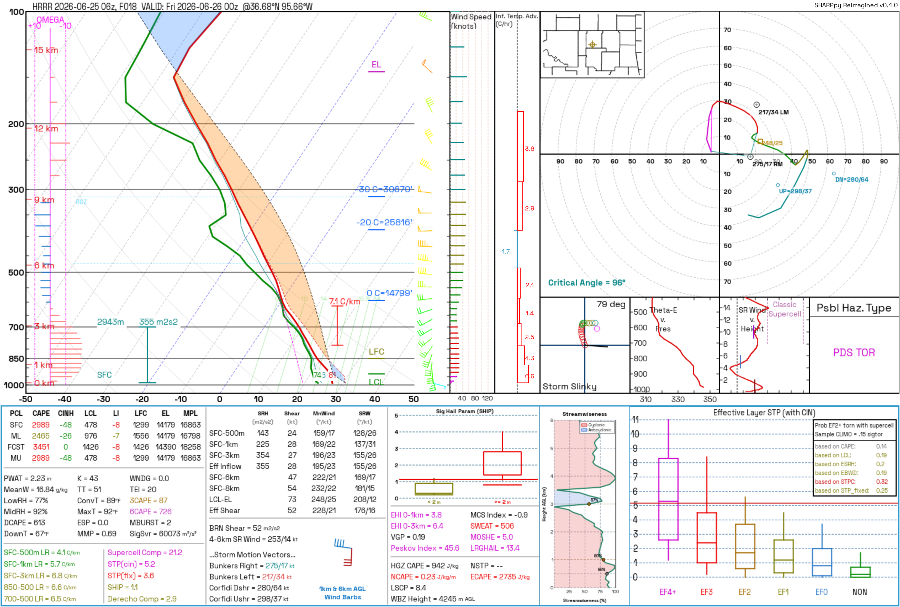
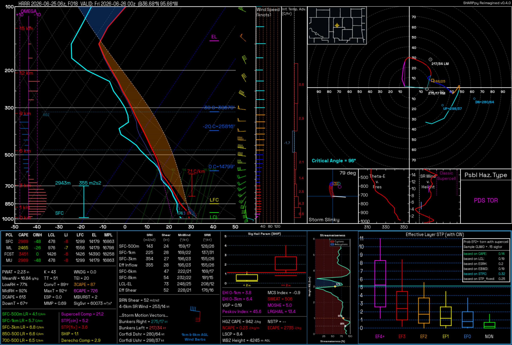

# Changelog

All notable changes to SHARPpy Reimagined are documented in this file.

The format follows [Keep a Changelog](https://keepachangelog.com/en/1.1.0/),
and the project uses [Semantic Versioning](https://semver.org/spec/v2.0.0.html).

## [Unreleased]

## [0.4.1] - 2026-07-16

### Changed

- Updated the Rust backend's `libloading` dependency from 0.8.9 to 0.9.0 and
  raised the source-build minimum supported Rust version from 1.86 to 1.88.
  Official binaries still bundle the native extension, and Python-fallback
  installations still do not require a Rust toolchain.

## [0.4.0] - 2026-07-16

### Added

- Added independently optimized Rust and Python backends for profile-array
  operations and direct pressure-level GRIB point decoding. Rust is the
  supported primary backend in official v0.4 binaries and whenever `auto`
  validates a compatible extension. Python remains the fully functional,
  portable fallback, while explicit modes expose compatibility failures instead
  of silently changing implementations.
- Added an all-model decoder matrix covering all 13 enabled forecast products:
  HRRR, RAP, NAM, NAM 3 km, HRW WRF-ARW, HRW FV3, RRFS-A, GFS, AIGFS, CFS,
  ECMWF IFS, ECMWF-AIFS, and GEFS.
- Added reproducible old-Python-versus-optimized-Python,
  old-hybrid-versus-optimized-Rust, and optimized-Python-versus-optimized-Rust
  benchmark drivers. Dated Markdown and JSON results under
  `benchmarks/results` retain fixture hashes, raw samples, selected grid
  coordinates, build fingerprints, unavailable stages, and equivalence output.
- Added cross-backend tests for selected point, pressure order, deduplication,
  missing masks, metadata, and scientific values within appropriate
  floating-point tolerances, including generated multi-field GRIB fixtures.

### Performance

- Replaced repeated Python cfgrib scans and full-grid xarray construction on
  compatible products with a direct ecCodes point decoder. It scans headers
  once per file identity, reuses the inventory and nearest-point selection,
  reads only required field/level scalars, and keeps bounded inventory,
  nearest-point, and exact decoded-sounding caches.
- Kept cfgrib as a functional compatibility path while reusing persistent
  indexes. Direct-decoder failures reduce split groups to a small point
  neighborhood before merge; products that require the established
  neighbor-wind vorticity calculation retain their full xarray merge.
- Added a Rust decoder that memory-maps the local GRIB subset, borrows message
  storage through ecCodes, releases the GIL during the immutable decode, and
  returns all sounding columns as one contiguous NumPy-compatible matrix in a
  single Python/Rust boundary crossing.
- Avoided speculative decoder parallelism. Profiling did not show a benefit for
  ordinary point soundings, so calls made by the Rust decoder remain serialized
  and the implementation focuses on fewer allocations, copies, and calls.
- Reused the existing model inventory for field planning and transport, passed
  cache-owned local GRIB subsets directly into the selected decoder, and kept
  source, run, valid-time, selected-point, field, unit, and lifecycle metadata
  unchanged through profile construction.

#### All-model decoder benchmark

Network transfer is excluded. Times are application-cold medians;
application caches and cfgrib indexes are cleared, while the operating-system
file cache is not flushed.

| Model | Production decode path | Levels old / optimized | Old/new omega | Old Python ms | Optimized Python ms | Python speedup | Old Rust hybrid ms | Optimized Rust ms | Rust speedup | Py/Rust optimized |
| --- | --- | ---: | --- | ---: | ---: | ---: | ---: | ---: | ---: | ---: |
| HRRR | direct GRIB (F000 may use point Zarr in auto mode) | 40 / 40 | matched | 13,656.191 | 6,666.527 | 2.05x | 13,623.801 | 6,325.879 | 2.15x | 1.054x |
| RAP | direct GRIB | 37 / 37 | matched | 4,468.287 | 2,213.136 | 2.02x | 4,442.193 | 2,095.314 | 2.12x | 1.056x |
| NAM | direct GRIB | 39 / 39 | matched | 8,174.641 | 1,233.397 | 6.63x | 4,003.166 | 980.808 | 4.08x | 1.258x |
| NAM 3km CONUS | direct GRIB | 42 / 42 | matched | 19,334.120 | 9,848.533 | 1.96x | 19,112.263 | 9,541.045 | 2.00x | 1.032x |
| HRW WRF-ARW | direct GRIB | 27 / 27 | matched | 7,927.530 | 3,963.836 | 2.00x | 7,966.092 | 3,858.457 | 2.06x | 1.027x |
| HRW FV3 | direct GRIB | 27 / 27 | matched | 7,553.566 | 3,518.836 | 2.15x | 7,719.979 | 3,432.609 | 2.25x | 1.025x |
| RRFS A | direct GRIB | 45 / 45 | matched | 14,380.822 | 6,821.914 | 2.11x | 14,533.194 | 6,379.690 | 2.28x | 1.069x |
| GFS | direct GRIB | 33 / 41 | matched | 14,502.366 | 3,609.185 | 4.02x | 14,454.516 | 3,333.053 | 4.34x | 1.083x |
| AIGFS | xarray vorticity fallback (direct point decoder benchmarked) | 13 / 13 | matched | 3,021.279 | 1,144.266 | 2.64x | 2,884.502 | 1,090.785 | 2.64x | 1.049x |
| CFS | direct GRIB | 37 / 37 | matched | 4,944.596 | 2,517.830 | 1.96x | 4,885.038 | 2,365.896 | 2.06x | 1.064x |
| ECMWF IFS Open Data | direct GRIB | 14 / 14 | matched | 3,487.357 | 1,330.818 | 2.62x | 3,438.142 | 1,239.230 | 2.77x | 1.074x |
| ECMWF-AIFS | xarray vorticity fallback (direct point decoder benchmarked) | 14 / 14 | matched | 2,926.893 | 1,123.699 | 2.60x | 2,930.174 | 1,049.424 | 2.79x | 1.071x |
| GEFS | xarray vorticity fallback (direct point decoder benchmarked) | 12 / 12 | different (12 -> 1 valid) | 927.236 | 246.907 | 3.76x | 900.190 | 201.013 | 4.48x | 1.228x |

Across all 13 fixtures, the geometric-mean speedups are **2.61x for Python**
and **2.65x for Rust**. Optimized Python divided by optimized Rust is 1.082x,
so optimized Rust has about 7.6% lower latency overall. The matrix's NAM row
contains an isolated system-wide timing stall; the separate five-repeat
[NAM confirmation](benchmarks/results/2026-07-16-nam-decoding-v0.4.0-windows-amd64.json)
measured 3.36x for Python and 4.04x for Rust.

`Old Rust hybrid` is the frozen historical cfgrib/xarray algorithm followed by
native wind post-processing; the old extension did not decode GRIB. See the
[complete benchmark report](benchmarks/results/2026-07-16-all-model-decoding-windows-amd64.md)
and [raw JSON record](benchmarks/results/2026-07-16-all-model-decoding-windows-amd64.json)
for fixture hashes, raw samples, equivalence results, and environment details.

### Fixed

- Decoded every logical field in packed GRIB multi-field messages, preserving
  both U and V winds when they share one physical byte offset. This fixes the
  layouts used by products including RAP, NAM, NAM 3 km, HRW WRF-ARW, HRW FV3,
  and CFS in both Python and Rust.
- Preserved every published pressure level while applying stable descending
  pressure sorting and aligned deduplication consistently across all columns.
- Aligned scalar-pressure variables to their actual pressure before xarray
  merging. In particular, a GEFS omega value published only at 850 hPa remains
  missing at all other levels instead of being broadcast or indexed as a full
  vertical column.
- Applied preference changes to the complete mounted sounding widget tree.
  Switching to **Inverted** now updates the Skew-T, hodograph, locator, storm
  slinky, insets, IndexBoard, and Streamwiseness panels immediately instead of
  leaving custom surfaces in the dark palette.
- Made inverted/light colors readable without changing scientific values or
  established dark palettes. Theme-dependent text and semantic annotations use
  a complete contrast-checked role palette, and headless rendering now honors
  the same selected inverted colors as the GUI.

#### Sounding palette previews

Both previews use the same checked-in HRRR profile, selected parcel, and viewer
state so only the palette changes.

##### Inverted / light mode

##### Protanopia colorblind mode

### Compatibility and limitations

- Products without a usable published relative- or absolute-vorticity field
  retain the xarray wind-gradient fallback in production so derived
  vorticity behavior is preserved, even though their direct point decoder is
  measured by the benchmark matrix.
- Optimized Python and Rust return matching pressure-aligned omega values and
  missing masks within the cross-backend tolerances. The GEFS cross-generation
  report's `12 -> 1 valid` difference is the intentional correction of the
  frozen legacy xarray scalar-pressure broadcast, not missing Rust
  functionality or a new scientific-value discrepancy.
- Rust is the supported primary backend in official v0.4 binaries and in
  `auto` mode whenever its versioned contract validates. Optimized Python
  remains the fully functional portable fallback for source installs and
  platforms without a compatible native extension; GUI and CLI behavior do not
  change when fallback is required.

## [0.3.1] - 2026-07-15

### Fixed

- ERA5 point extraction now accepts scalar latitude/longitude coordinates from
  zero-area CDS responses and does not mistake a snapped singleton coordinate
  for the source dataset's geographic coverage.
- ECAPE's NCAPE calculation now evaluates only through the equilibrium level,
  avoiding invalid saturation calculations in unused upper-stratospheric
  levels.
- Windows builds now analyze from the actual repository root so the local
  `sharpmod` package is embedded, and frozen runtime verification checks
  `logging.handlers` and the GUI entrypoint in both build formats.

## [0.3.0] - 2026-07-14

### Added features

- Portable `.sharpmod-session` analysis sessions that save and restore every
  sounding in a viewer, the active profile/time/member, profile and storm-motion
  edits, interpolation state, parcel selection, and supported viewer state.
  Sessions use validated, versioned JSON and never embed source GRIB downloads.
- Fifty-step undo/redo history for mouse and numeric profile edits,
  interpolation and reset actions, and storm-motion changes. Use `Ctrl+Z` and
  `Ctrl+Y`, or the new Edit menu actions.
- Availability-aware forecast-model selection. The picker checks the selected
  model, run, forecast hour, and member in the background and offers an explicit
  **Use available cycle** action when a newer selection has not been published.
- Multi-sounding analysis windows with profile focus/removal controls and a
  remembered option to add newly opened soundings to the active viewer.
- A validated **Edit Nearest Level** dialog for pressure, height, temperature,
  dewpoint, wind direction, and wind speed, with immediate recalculation of
  derived displays.
- Maximum Parcel Level (MPL) values in the parcel table and Skew-T level labels.
- Persistent GUI preferences for units, colors, readouts, default parcel,
  multi-sounding behavior, dismissed tips, recent files, and picker selections.
- Worldwide coast, country, and state/province outlines in the hodograph locator
  while retaining the detailed U.S. county overlay.
- Three-hourly observed-sounding selection from 00Z through 21Z on both the
  station map and station list, including special/asynoptic launch times.
- Accelerated forecast retrieval with a direct HRRR analysis-Zarr point path,
  NOAA NOMADS geographic subsetting where supported, adaptive coalesced HTTP
  ranges for other indexed providers, and automatic fallback to Herbie's
  standard downloader.
- A persistent, bounded forecast-model cache plus optional **Prefetch Next
  Forecast Hour** and **Clear Downloaded Model Cache** File-menu actions.

### UX improvements

- Removed calendar dates from sounding titles while retaining compact run and
  valid UTC hours, forecast hour, and coordinates.
- Model availability checks are debounced and ignore stale worker results.
  Unknown or transient probe failures leave manual Fetch available, and the
  selected run is never changed without user confirmation.
- Added forecast-download stage and byte progress reporting, actionable
  GRIB-runtime errors, and a Help action that opens the rotating GUI diagnostic
  log folder.
- Reuses a decoded full-GRIB forecast hour when another point is requested from
  the same model, run, forecast hour, and member. Point/subregion downloads are
  cached by coordinate so data from one location cannot be reused for another.
- Added a dedicated Cancel button for forecast retrieval. Compatible range
  downloads retain verified partial fragments so an interrupted request can
  resume instead of restarting every byte.
- The fast path automatically races equivalent Herbie mirrors, remembers the
  quickest healthy provider for six hours, and reports the chosen transport
  and fields in the point sounding's metadata.
- Small indexed subsets use direct ranges instead of paying the NOMADS CGI
  preparation cost; geographic NOMADS cropping is reserved for transfers above
  32 MiB or inventories whose size cannot be determined safely.
- Optional next-hour prefetch is disabled by default, runs independently of the
  active fetch, and never opens a viewer or replaces the user's selection.
- Kept custom-panel numeric values readable by measuring and drawing compact
  unit suffixes before applying overflow elision.

### Bug fixes

- Replaced the removed Herbie `era5` model path with official Copernicus CDS
  pressure-level retrieval, including all 37 levels, point-sized requests,
  temporary-GRIB cleanup, and actionable CDS credential guidance.
- Restored forecast-model availability checks and downloads on Windows Python
  3.14 by loading the ecCodes DLL bundled in its pure-Python wheel when a
  version-specific `_eccodes` helper wheel is unavailable.
- Moved automatic model-availability GRIB validation onto the main Qt thread
  before starting a probe worker.
- Prevented native Windows GUI startup crashes under Python 3.14 by handing
  source-checkout launches to the project's Python 3.11-3.13 environment before
  `QApplication` starts. Packaged releases already bundle Python 3.11.
- Prevented duplicate concurrent requests for the same model hour with
  single-flight cache loading, while allowing different hours to proceed
  independently.
- Included the point location in persistent cache identity so two locations can
  never reuse the wrong extracted sounding, and protected in-use entries from
  age/size pruning.
- Validated HTTP partial-content responses, entity tags, file size, and GRIB
  boundaries before publishing resumed or coalesced downloads.
- Handled RAP inventories that expose packed U/V wind messages at a shared byte
  offset, preventing the optimized range path from unnecessarily falling back
  to a full Herbie download.

### Code improvements

- Replaced the monolithic `sharpmod.gui` implementation with a small compatible
  facade and focused picker, settings, fetch-worker, map, session, viewer, and
  shared-runtime modules.
- Moved renderer monkeypatch installation into one ordered registry that checks
  for the supported SHARPpy version before applying any patches.
- Analysis-session files contain decoded sounding state only, preserving the
  existing cleanup lifecycle for temporary forecast-model data.
- Added a bounded, lease-aware model-hour cache that owns shared GRIB data
  independently from viewer-scoped point files and safely closes decoded
  datasets on eviction or application shutdown.
- User-facing package, window, and renderer version labels now read from
  `sharpmod._version.__version__` as the single source of truth.
- Added focused field planning that selects one available humidity field and
  one available vertical-motion field while retaining every pressure level
  published by the selected model.
- Split accelerated retrieval into field-planning, range-transport, provider,
  disk-cache, and HRRR-Zarr modules with cancellation and fallback boundaries
  that can be tested independently.

### Packaging and project maintenance

- Added `cdsapi` to the ERA5 optional dependency set and bundled the CDS/ECMWF
  runtime modules in standalone GUI builds.
- Expanded the frozen-launcher dependency check to verify that CDS retrieval is
  available before the GUI starts.
- Bundled and runtime-checked `numcodecs` and `pyproj`, which are required by
  the HRRR Zarr point backend.
- Stopped tracking generated `sharpmod.egg-info` directories, standardized text
  line endings with `.gitattributes` and `.editorconfig`, and archived the stale
  outer wrapper and artifacts so the repository has one obvious project root.
- Excluded AI-agent plans and metadata, the internal engineering backlog,
  legacy `attic` prototypes, local analysis sessions, credentials, logs, and
  scratch files from consumer-facing source releases.

### Tests and documentation

- Added regression coverage for analysis sessions, edit history, model
  availability, GUI module boundaries, settings persistence, multi-sounding
  behavior, level editing, MPL display, patch registration, and versioning.
- Added ERA5 CDS request, missing-credential, forecast-model registry, and frozen
  packaging regressions so removed or unbundled data-provider integrations fail
  during testing instead of at runtime.
- Added retrieval regressions for field pruning, adaptive range coalescing,
  resume validation, provider selection, persistent cache pruning, single-flight
  loading, HRRR Zarr decoding, cancellation, and background prefetch.
- Updated the README, usage guide, and installation notes with CDS account,
  dataset-licence, `.cdsapirc`, and optional-dependency setup instructions.
