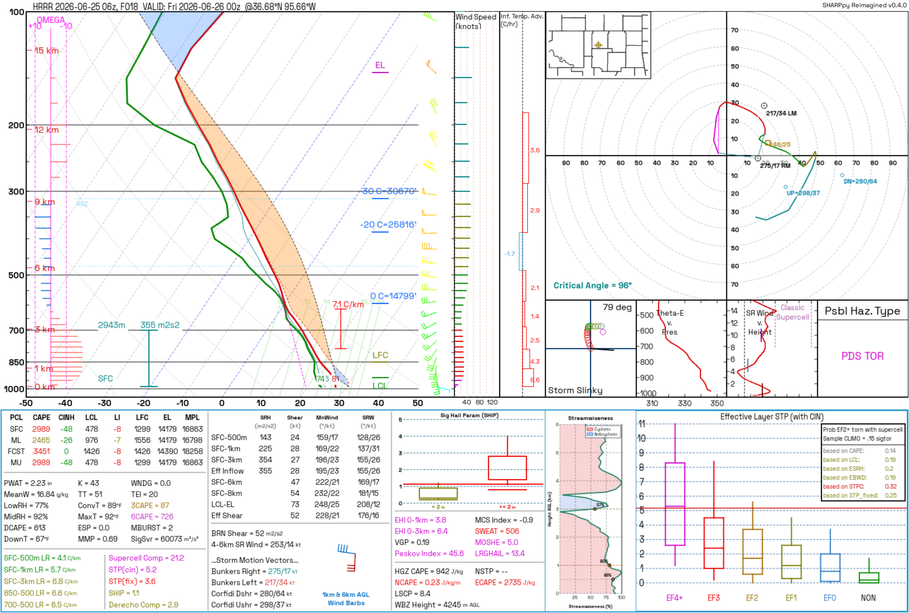
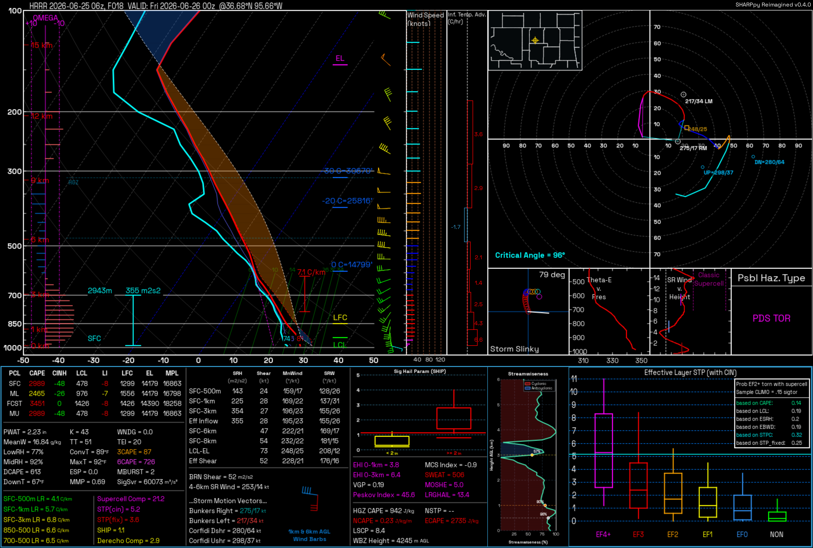

# Changelog

All notable changes to SHARPpy Reimagined are documented in this file.

The format follows [Keep a Changelog](https://keepachangelog.com/en/1.1.0/),
and the project uses [Semantic Versioning](https://semver.org/spec/v2.0.0.html).

## [0.8.1] - 2026-08-10

### Fixed

- Reduced Windows first-window time by lazily constructing inactive picker
  tabs, deferring model-cache imports and pruning, importing the analysis stack
  only when a sounding opens, and sharing immutable basemap geometry.
- Reused a successful observed-sounding availability download when Generate is
  pressed instead of fetching and decoding the same profile twice.
- Deleted ordinary sounding viewers when closed, released picker references,
  and collected their Python widget cycles on the next event-loop turn so
  repeated open/close sessions no longer retain one viewer heap per cycle.
- Hardened Windows packaging so source, bundled Python metadata, Rust metadata,
  frozen runtime, and PE file/product versions must agree; official builds now
  reject stale editable metadata and optionally Authenticode-sign when both
  certificate secrets are configured.
- Made the faster one-folder ZIP the prominently labeled recommended Windows
  download while retaining the one-file build as an explicitly slower portable
  option, with signing state recorded in the release manifest.
- Restored normal HRRR point-sounding latency by making experimental regional
  TOI guidance explicit opt-in. Version 0.8.0 synchronously requested up to
  eight extra regional frames before writing and displaying an otherwise-ready
  point sounding; `--regional-guidance`, `live_regional_guidance=True`, or
  `SHARPMOD_REGIONAL_GUIDANCE=on` now enable that supplemental work deliberately.
- Made model downloads and GUI availability checks cancellation-aware and
  bounded, kept stale availability probes single-flight, isolated supplemental
  HRRR frames from reusable point-sounding cache payloads, corrected per-frame
  byte progress, and disconnected closed sounding windows from live preference
  updates.
- Updated the locked release toolchain to pip 26.2.1, Ruff 0.16.1, and PyO3
  0.29.2, while keeping workflow bootstrap pins sourced from the release
  constraints so patch updates cannot make the release build self-conflicting.

## [0.8.0] - 2026-08-07

**TOI status, stated plainly.** The full offline programme has now been executed
end to end on real data, and the honest result is that **TOI does not beat
climatology on held-out years**. A real model was fitted and it was *not*
promoted. Details are in "Measured result" below. TOI remains experimental, is
not official SPC guidance, and its `high_risk_worthy_proxy_v1` target is a
transparent, versioned SHARPpy-defined proxy that is never labelled official Risk
Impact Value.

### Measured result (v1 method — SUPERSEDED, see "Re-measured on v2" below)

> The tables in this section were produced with the anchor and jet-tracking
> defects described in "Two method defects" below. They are kept because they are
> what the shipped transform was evaluated against at the time, and because the
> v1-to-v2 movement is itself the evidence that the defects mattered. **For
> current numbers use "Re-measured on the corrected method (v2)".**
Collected 337 usable cases from a 600-case stratified catalogue built from
versioned NOAA NCEI Storm Events exports (11 files, SHA-256 recorded per year),
development years 2015-2022 and untouched test years 2023-2025, event-blocked,
population-weighted, plan frozen at hash `b3b983f473b5e11b` before any held-out
number was examined.

Held-out 2023-2025 (105 cases, 18 positive event groups):

| Forecast | Brier | Brier skill vs climatology |
|---|---:|---:|
| Climatology (reference) | 0.0809 | 0.000 |
| Fitted logistic calibration | 0.0820 | **-0.013** |
| Shipped public-anchor transform | 0.1263 | **-0.561** |

Grouped paired bootstrap of the Brier improvement: versus climatology
-0.0011 with a 95% interval of [-0.0058, +0.0039], which straddles zero, so **no
improvement is demonstrated**; versus the shipped public-anchor transform
+0.0443 with [+0.0130, +0.0767], which **is** a real improvement.

Two conclusions follow, and they point in opposite directions:

1. The current two-feature calibration (TOI score, peak-STP bin) adds no
   demonstrable skill over simply quoting the base rate. Fitted slope 0.469 and
   intercept -1.146 indicate an over-spread, miscalibrated forecast. Stratified
   skill is worse still in places: summer -0.153 over 48 cases and the northern
   plains/midwest region -0.282 over 25 cases.
2. The shipped public-anchor probability transform is **substantially worse than
   climatology** (Brier skill -0.561, FAR 0.905), and the fitted model beats it
   with a confident interval. That is evidence about the shipped default, not
   just about the candidate.

The artifact is therefore recorded as `validated: false` and the shipped
transform remains the default, unchanged. Promotion blockers as reported by the
gate: no Brier improvement over climatology at 95% confidence, three degraded
strata, negative held-out Brier skill, and no prospective shadow season. The
prospective season reserved in the frozen plan is 2027 spring, which by
construction cannot be evaluated yet.

Remaining work is scientific, not mechanical: the feature set needs to improve
before a promotion attempt is meaningful. Enlarging the catalogue would firm up
the intervals but would not turn a negative skill score positive.

### Feature diagnostic (development years only)

`scripts/diagnose_toi_features.py` compares candidate feature sets by
leave-one-year-out cross-validation **inside the development years**, reusing the
production estimator. It never reads 2023-2025: fitting a different feature set
and scoring it on the reserved test period would use that period to *choose* a
model, which is the contamination the pre-registration exists to prevent, and it
would spend a test set that can only be spent once. The output is a direction to
pre-register, never evidence of skill.

Pooled out-of-fold over 234 development cases with 32 positives, re-run on the
corrected v2 archive (v1 figures in brackets):

| Feature set | Brier skill | AUC |
|---|---:|---:|
| STP bin only | +0.0099 [+0.0132] | 0.623 [0.639] |
| Raw peak STP only | +0.0095 [+0.0211] | 0.643 [0.659] |
| STP bin + raw STP | +0.0072 [+0.0200] | 0.639 [0.655] |
| STP bin + jet-to-risk distance | +0.0061 [+0.0080] | 0.599 [0.604] |
| Frozen plan: score + STP bin | +0.0037 [+0.0198] | 0.608 [0.640] |
| Experimental TOI score only | **-0.0061** [-0.0029] | **0.462** [0.526] |
| All six features | -0.0102 [+0.0124] | 0.561 [0.603] |

The ordering is unchanged in the part that matters and the composite score got
*worse*, not better: alone it now scores AUC 0.462, below a coin flip, and the
frozen plan's own schema fell from +0.0198 to +0.0037. Correcting the two defects
removed spurious variance that the score had been borrowing from; what is left
discriminates less. Peak STP alone still carries whatever signal exists.

Three conclusions, and the third is the one that matters:

1. **The composite TOI score is the weakest input, not the strongest.** Alone it
   is worse than climatology and barely better than a coin flip. Peak STP - a
   standard parameter the sounding already displays - carries whatever signal
   exists, and adding jet-to-risk distance to it makes the result worse.
2. **Adding features hurts.** All six together score below raw peak STP alone,
   which is what overfitting looks like with 32 positive cases.
3. **Switching features will not rescue TOI.** The frozen plan's schema scored
   +0.0198 in development and **-0.013** on held-out years. A development gain of
   +0.0211 is therefore entirely consistent with zero or negative test skill, and
   the differences between the top rows are well inside the noise of 32
   positives. The problem is not the weighting; the whole feature set tops out
   near AUC 0.66, which for a ~7% base rate yields negligible Brier improvement.

The blunt implication: TOI currently adds nothing over reading peak STP, which is
already on screen. No feature-reweighting change is therefore proposed, because
proposing one would imply a fix that the evidence does not support.

### Two method defects found and fixed, and what they invalidate

Auditing the highest-scoring archive cases exposed two defects in the TOI feature
method itself, not in its weighting. Both were measured against the shipped
337-case dataset before being fixed.

**1. The anchor could escape the CONUS land domain.** Anchor selection scored
objects by integrated proxy-STP discounted by land fraction, then took the
intensity-weighted centroid of *every* member point. For a large land-and-ocean
crescent that centroid can sit in water even though the object passes the 0.5
land-fraction minimum. An earlier fix rejected offshore *peaks*; it never
constrained offshore *centroids*.

Measured in the shipped dataset: **11 of 337 anchors (3.3%) fall outside the
CONUS land mask** — open Atlantic and Gulf water plus one point in Manitoba — and
**all 11 are negative cases**. The defect only ever manufactured false alarms,
which is consistent with the measured FAR of 0.905. The worst example is the
archive's highest-scoring case overall: `null-2018-04-16`, score 4.49, a
**zero-tornado day** anchored at 31.75N 79.74W, roughly 200 km off Georgia, from
a 403,143 km² / 400-point object with land fraction 0.698.

Exposure across the archive, counted from the 335 of 337 per-case payloads that
still resolve by cache key: **109 (32.5%) selected a mixed land-and-ocean object**
(land fraction below 1.0, minimum 0.500), which is the precondition for the
escape; 134 (40.0%) exceeded 100,000 km², largest 1,693,203 km², median 62,487 km²;
and 68 were both mixed and larger than 100,000 km².

The anchor is now built in two steps that cannot leave land: the
intensity-weighted centroid is taken over the object's **land members only**,
then snapped to the land member nearest it. The result is always an actual land
grid point belonging to the object. Both the pre-snap land centroid and the snap
distance are recorded in provenance so the constraint is auditable rather than
asserted.

The snap distance is *not* bounded by one grid step, and an earlier draft of this
entry wrongly claimed it was. Archive anchor resolution decodes at stride 12,
about 36 km on the 3 km HRRR grid, and a land centroid falling in a wide water gap
snaps to the nearest land member — measured up to roughly 90 km during collection.
That is recorded per case as `anchor_snap_km`. It remains a strict improvement,
because every alternative leaves the anchor in open water.

**2. Jet-object association was bounded in distance but not in speed.** Tracking
used a fixed match radius — 1200 km by default, 1800 km in the live HRRR producer
— with no reference to the gap between frames. At the 3-hourly TOI sampling
interval an 1800 km jump implies 324 kt, so the matcher could link two unrelated
jet streaks and the endpoint-to-endpoint translation speed inherited the jump.

Measured in the shipped dataset: translation speed reaches **257.3 kt**, with
**44 of 337 cases (13.1%)** above the new ceiling and 89 above 50 kt, where the
scorecard's translation component already saturates. Translation carries weight
0.45–0.75, so these artifacts populate the top of the score range. `null-2018-04-16`
carries both defects at once: an offshore anchor *and* 135.7 kt translation.

Association now applies a kinematic ceiling of `DEFAULT_MAX_JET_TRANSLATION_KT`
(90 kt) over the actual inter-frame gap, additionally clamped to the stronger of
the two objects' peak winds, since a coherent jet maximum cannot propagate faster
than the flow that forms it. Because the endpoint great-circle displacement can
never exceed the sum of the per-step displacements, bounding each step also
bounds each track's reported translation speed by the same ceiling — the
invariant is a consequence of the fix, not a separate clamp, and is covered by a
parametrised test.

**What this invalidated.** `TOI_RISK_OBJECT_METHOD_VERSION` is bumped to
`sharpmod_toi_risk_object_selection_v2` and feeds the archive scientific content
hash and every case cache key, so v1 cache entries cannot be silently reused. A
resume therefore re-collects rather than skipping, which is what
`case_cache_key` already documented as a requirement. The raw regional grids were
not retained, so features could not be recomputed in place; the archive was
re-collected in full (see "Re-measured on the corrected method (v2)").

**Verified on the real cycle that produced the defect.** Both fixes were
re-checked against the same live HRRR data, not a synthetic grid, by re-resolving
`null-2018-04-16` from the 2018-04-15 06Z cycle at F018. Recorded in
`archive/null-2018-04-16-v2-recheck.json`:

| Quantity | v1 | v2 |
|---|---:|---:|
| Anchor | 31.7462N 79.7385W (**Atlantic**) | 33.1733N 79.8410W (**land**) |
| Jet translation | 135.71 kt | **22.88 kt** |
| Maximum jet | 60.86 kt | 71.35 kt |
| Experimental score | 4.49 | **2.47** |
| Public-anchor probability | 0.6918 | **0.0380** |

The selected object is *identical* — 403,143.6 km², land fraction 0.698 — which
confirms detection and scoring are untouched and only the anchor placement
changed. The land centroid resolved to 33.2958N 79.9189W and snapped 15.43 km
onto the grid. Temporal sampling stayed `complete` at 7 frames over 18 h.

So the archive's highest-scoring case, a **zero-tornado day** that the shipped
transform rated a 69% high-risk probability, now scores 2.47 at 3.8%. That is the
dataset's single largest false alarm corrected by roughly 18x in probability.

### Re-measured on the corrected method (v2)

The archive was recollected end to end under v2 and the whole pipeline re-run.
**90.8 min wall across 6 shards against 8.41 h of summed shard time (5.6x), 34.2
GiB transferred, 339 verified cases, zero verification failures.**

The v2 results now occupy the canonical paths — `data/toi_dataset.{json,csv}`,
`models/toi-calibration.json`, `reports/{compile,train,feature-diagnostic}.json`,
plus the new `reports/evaluate-v2.json` — and the complete v1 set is preserved
unmodified under `archive/v1-artifacts/`. Leaving the default paths on v1 was
briefly the state of this branch and was wrong: `scripts/diagnose_toi_features.py`
defaults to `data/toi_dataset.json`, so anyone running it would have silently
analysed defective-method data. The frozen plan `reports/toi-plan.json` is
deliberately **not** rewritten; it is the pre-registration as it was frozen, and
its `notes` still name the v1 dataset hash `dd4f68220e44fdc5` so the reuse is
visible rather than papered over. The v2 dataset hash is `f0a42da4938972c8`.

**No case regressed.** Of the 475 events attempted under both methods, every
single one ended in the same state: 264 success, 160 failed, 51 skipped. The v2
run additionally reached 121 events the v1 run never attempted, which is where
the extra successes came from. The anchor fix did not make anchor resolution
stricter; it changed only where an accepted object is anchored.

Both defects are gone from the data:

| Invariant | v1 | v2 |
|---|---:|---:|
| Anchors outside the CONUS land mask | 11 | **0** |
| Maximum jet translation | 257.3 kt | **59.8 kt** |
| Cases above the 90 kt ceiling | 44 | **0** |

Held-out 2023-2025, same 105 cases and 18 positive event groups, same frozen
plan and feature schema:

| Forecast | v1 Brier | v1 skill | v2 Brier | v2 skill |
|---|---:|---:|---:|---:|
| Climatology (reference) | 0.0809 | 0.000 | 0.0814 | 0.000 |
| Fitted logistic | 0.0820 | -0.013 | 0.0822 | **-0.010** |
| Shipped public-anchor transform | 0.1263 | -0.561 | 0.0910 | **-0.118** |

Grouped paired bootstrap of the Brier improvement, 1000 resamples:

| Comparison | v1 | v2 |
|---|---|---|
| vs climatology | -0.0011 [-0.0058, +0.0039] | -0.0008 [-0.0046, +0.0034] |
| vs shipped transform | +0.0443 [+0.0130, +0.0767] **significant** | +0.0088 [-0.0060, +0.0264] **not significant** |

Held-out AUC rose slightly for both: fitted 0.6149 to 0.6373, transform 0.5504
to 0.5661. The transform's false-alarm ratio fell from 0.905 to 0.678.

Three conclusions, and the middle one is a correction to what this changelog
previously claimed:

1. **The defects mattered, and mostly to the shipped transform.** Its Brier skill
   improved from -0.561 to -0.118, nearly five times less bad, and its FAR fell
   from 0.905 to 0.678. Most of its apparent badness was the two defects
   manufacturing confident false alarms, not the transform's own shape.
2. **The fitted model no longer beats the shipped transform.** Under v1 that
   margin was +0.0443 with a 95% interval clear of zero, and this changelog
   called it "a real improvement". Under v2 it is +0.0088 with an interval that
   straddles zero. That earlier claim does not survive the correction and is
   withdrawn.
3. **TOI still does not beat climatology.** Brier skill -0.010, bootstrap
   -0.0008 with a 95% interval of [-0.0046, +0.0034] straddling zero. The
   headline conclusion is unchanged: fixing two real defects moved the numbers
   without producing skill.

The promotion gate still refuses, now on seven blockers: no Brier improvement
over climatology at 95% confidence, no improvement over the shipped transform,
three degraded strata (northern plains/midwest -0.259 over 25 cases, southern
plains/lower Mississippi -0.054 over 59, summer -0.121 over 48), negative
held-out Brier skill, and no prospective shadow season. The artifact is recorded
`validated: false`, the shipped transform remains the default, and the sounding
continues to display the unvalidated 0-5 `hypothetical` score rather than a
percentage.

One caveat stated plainly: the pre-registered plan was frozen before any v1
held-out number was examined, but those years have now been examined twice, once
per method. This is a re-derivation of the same pre-registered analysis on
corrected inputs, not a fresh pre-registration, and no feature or model choice
was changed in response to seeing v1 results. The reserved prospective season is
still 2027 spring.

`TOI_MEASURED_SKILL_VERSION` advances to
`sharpmod_toi_measured_skill_2015_2025_v2` and the note shown in the details
dialog now carries the v2 numbers, because a disclosure quoting a superseded
measurement is a wrong disclosure.

### What the measurement changes about where TOI runs

Now that the experimental readout is measured at AUC 0.462 — below a coin flip —
the question is no longer whether it is honest, because the `hypothetical` marker
and the `Measured skill` row already handle that. The question is whether it is
worth its cost, and the cost is unrelated to labelling: the guidance needs seven
extra regional HRRR frames, roughly 60-85 MiB and tens of seconds, on **every**
extraction.

That splits cleanly by whether a human is looking:

- **Interactive extraction is unchanged.** The GUI and single-point
  `model-extract` still follow the `auto` policy, so a forecaster deliberately
  pulling one sounding still gets the experimental readout. Choosing to look at a
  clearly labelled research number is legitimate, and nothing here removes it.
- **Bulk extraction now skips it.** `BatchExtractor.DEFAULT_LIVE_REGIONAL_GUIDANCE`
  is `False`, so an unattended job no longer downloads seven extra frames per
  point for a row nobody is reading. `model-batch-extract --regional-guidance`
  and `BatchExtractor(live_regional_guidance=True)` opt back in, and the global
  `SHARPMOD_REGIONAL_GUIDANCE` override still wins.

No layout changed and no display logic changed: a point with no guidance payload
already renders `--` in the TOI row, which is an existing, tested path.

Deliberately **not** done: porting TOI to RAP, NAM 3 km CONUS nest, or HiResW.
The inventory probe confirmed all three already publish the five required searches
in the very product the app downloads, so the port would be cheap — which is
exactly the trap. It would multiply the download cost by four to spread a number
that measures at chance. The feasibility findings are recorded so the decision can
be revisited if a future version earns it.

### Added

- The TOI details dialog now states the **measured** skill of the probability it
  is showing. `TOI_MEASURED_SKILL_NOTE` and `TOI_MEASURED_SKILL_VERSION` record
  that the shipped public-anchor transform scored a Brier skill of -0.118 against
  climatology with a false-alarm ratio of 0.678 on the 339-case v2 archive, so it
  is measurably worse than quoting the base rate, and that no fitted alternative
  beat climatology either. (The first release of this note quoted -0.561 and
  0.905, measured before the anchor and jet-tracking defects were fixed; the
  version string is what lets a reader tell the two apart.) The note is promoted to a `Measured skill` row
  immediately after `Status / limitation` rather than left at the bottom of the
  generic provenance dump, because a disclosure that lives only in a changelog is
  not a disclosure. The evaluation is versioned so a later one supersedes it, the
  note is attached only to the shipped transform (a selected offline artifact
  carries its own validation state), and a test asserts the text fits the
  provenance length cap — a warning truncated mid-sentence would be worse than
  none. **The sounding layout is unchanged and the default transform is
  unchanged**; only the explanation is now honest about measured performance.
- Added `scientific_content_sha256`, a versioned hash computed from canonical
  strict JSON over only the schema-versioned scientific inputs of a case: cache
  inputs, case and label data, the resolved anchor, operational guidance and
  features, method and schema versions, and source identities. Timestamps, retry
  timing and logs, elapsed time, and transfer bytes are excluded, so an identical
  rerun on a different clock reproduces the same hash. The previous case hash
  included `extracted_at` and therefore changed on every rerun. A separate
  `artifact_sha256` over the final file bytes is recorded in the checkpoint and
  manifest rather than embedded self-referentially inside the file it describes.
- Hardened `verify-toi-archive` into a real verifier. It recomputes every
  scientific and artifact hash instead of trusting the embedded values,
  recomputes cache keys from the recorded cache inputs, validates strict schema
  and finite values, and reports filename/cache-key mismatches, duplicate event
  or cache keys, orphan and missing case files, checkpoint/file status
  disagreement, target/method/source mismatches, truncated or tampered JSON, and
  missing source hashes. Any failure exits non-zero with explicit counts and
  paths.
- Added `sharpmod-guidance compile-toi-dataset`, which turns verified extracted
  case JSON into a `TOIDataset` with **zero network access**, so the roughly
  43 GiB archive collection is a one-time cost and retraining never refetches
  HRRR. It maps the exact operational TOI features and documented labels and
  weights, carries event, `event_year`, region, season, lead, HRRR-era, source,
  and hash provenance through to the dataset, refuses unverified input and
  duplicate cache keys, preserves skip reasons, and emits the format `train-toi`
  and `evaluate-toi` accept directly.
- Added `scripts/fetch_ncei_storm_events.py`, which downloads the versioned NCEI
  Storm Events detail files and writes a manifest recording each file name, URL,
  byte count, and SHA-256. Retaining the raw versioned CSVs is what makes label
  provenance auditable: NCEI republishes corrected years, so the `c20260323`
  build of 2018 is a different dataset from a later one. Downloads skip files
  already present, so the script is resumable.
- Added `scripts/run_toi_archive_parallel.py`, which runs event-indivisible
  shards as isolated parallel processes. This is what makes the collection
  practical: the sequential runner needs ~15 h for 600 cases, and moving it to a
  cloud VM at parallelism 1 would take exactly as long. Processes are used rather
  than threads because the runner's correctness already rests on a single-writer
  `run.lock`, atomic `.partial` writes, and a per-run checkpoint; threading would
  put all three onto shared mutable state, whereas each shard gets its own
  catalogue, work directory, checkpoint, and lock, so N workers are N independent
  proven-correct runs. **Measured on 6 workers: 230 s wall against 882 s of
  summed shard time, a 3.8x speedup**, with budgets applied per shard.
- Added a real-data TOI training programme for the 2015-2025 HRRR archive:
  `sharpmod-guidance audit-archive`, `build-toi-catalog`, `run-toi-archive`, and
  `verify-toi-archive`. The catalogue generator reads official NOAA NCEI Storm
  Events bulk CSV exports (recording each file name, retrieval date, byte count,
  and SHA-256), reduces tornado segments to one record per convective day,
  applies the named `high_risk_worthy_proxy_v1` screen, and samples a stratified
  outbreak / ordinary-severe / null catalogue across regions, seasons, forecast
  leads, and HRRR eras with the measured population base rate preserved. One
  event id per convective day keeps every cycle of an event in one `event_year`.
  Case anchors are resolved at run time from forecast proxy-STP around a fixed
  CONUS centre, so no predictor or anchor can use later tornado locations.
- Added a production-grade resumable archive runner: deterministic cache keys
  hashing every feature-changing input including the method version, atomic
  `.partial` writes, SHA-256 content hashes, a JSONL checkpoint that tolerates a
  crash-truncated final line, a `run.lock` single-writer guard, exponential
  backoff with seeded full jitter, a minimum request interval, cancellation, and
  hard caps on transfer bytes, case count, wall time, and free-disk headroom.
  Raw GRIB subsets are deleted immediately after extraction, so a 600-case run
  transfers about 43 GiB but retains under 3 MiB. Feature extraction is
  delegated verbatim to the operational producer, so archived cases use exactly
  the live sampling and feature code.
- Documented two measured archive findings: the official bucket publishes no F18
  at 06Z before HRRRv2 (2016-08-23), so 2015-2016 cases reach only 15 h of
  coverage and are reported `degraded`; and a genuinely quiet control day has no
  forecast proxy-STP region at all, which makes TOI undefined rather than
  negative, so null controls are drawn from convective-season days.
- Added an offline, reproducible TOI calibration pipeline behind a new
  `sharpmod-guidance` CLI (`build-toi-dataset`, `train-toi`, `evaluate-toi`).
  Historical feature extraction reuses the operational live producer, so
  archived cases get identical jet tracking, objective risk-region selection,
  STP proxy, and three-hourly temporal sampling. Outcomes either come verbatim
  from a documented label manifest, or from a transparent, versioned
  SHARPpy-defined `high_risk_worthy_proxy_v1` screen over NCEI tornado data;
  official Risk Impact Value is not an available target and the proxy is never
  labelled RIV. Manifests must cover outbreak, ordinary severe, and null cases,
  and anchors derived from observed tornado locations are rejected as leakage.
- Added a regularized logistic TOI calibrator with year- and event-blocked
  validation (leave-one-year-out or expanding-year) plus an untouched test
  period. Each event id is assigned one `event_year`, so a case series that
  crosses a New Year boundary stays inside a single fold instead of straddling
  training and test, and a dataset whose rows disagree about an event's blocking
  year is rejected. Reports cover Brier score and skill, reliability bins,
  calibration intercept/slope, POD, FAR, CSI, frequency bias, ROC area, average
  precision, and event-blocked bootstrap intervals against both the shipped
  public-anchor transform and climatology. Fitted models export a portable JSON
  artifact whose runtime inference needs no scikit-learn, and an artifact is
  marked validated only when a declared multi-year historical dataset beats both
  references on held-out years. The shipped transform remains the default and a
  validated artifact must be selected explicitly; its version, training years,
  target, and validation state appear in TOI provenance and the details panel.
- Every dataset, artifact, and report writer emits strict, portable JSON
  (`allow_nan=False`). Empty reliability bins and contingency scores without a
  denominator serialize as `null` instead of `NaN`, and a non-finite metric is
  refused with a clear error rather than written as a non-standard token.
- Average precision now groups tied forecast probabilities into one operating
  point, making it permutation-invariant; a completely uninformative forecast
  scores exactly the weighted event base rate.
- Dataset rows record the scorecard version and the public-anchor
  probability-transform version in separate, clearly named fields
  (`scorecard_version` and `public_anchor_probability_version`).
- Added a validated regional Tornado Outbreak Indicator (TOI) contract plus
  experimental midlevel jet tracking. The shared GUI/headless sounding display
  embeds a normal `TOI = probability` row in the composite-index block.
- Added a bounded live HRRR regional producer that automatically embeds
  experimental TOI guidance in forecast soundings. It tracks 300/500-hPa jets
  across up to 18 hours, derives a fully provenance-labeled fixed-layer STP
  proxy risk region, and applies a versioned non-official scorecard/probability
  transform anchored to the bins and examples in the public SPC paper.
- Added a click-through TOI explanation dialog without changing the sounding
  layout. It exposes the probability/color tier, experimental score, every
  regional input, score-component weighting, method/calibration versions,
  limitation text, valid period, source, and full embedded provenance; an
  unavailable result shows `--` plus its exact reason.
- Added checked JUnit performance budgets and JSON timing artifacts, bounded
  pytest-xdist lanes with one Qt/render worker group, a 3.11/3.12 compatibility
  smoke, one Python 3.13 coverage lane, one full 100-200-example property lane,
  and an exact non-parallel release gate.

### Fixed

- Bounded the 1 hPa layer-mean sampling by the layer it is asked for. Both
  `mean_wind` and `mean_wind_npw` built their sample pressures with
  `arange(pbot, ptop + dp, dp)`, which takes one step **past** the layer top
  whenever the layer depth is not a whole number of hectopascals. When that
  overshoot left the reported profile the sample interpolated to `MISSING` and
  was silently dropped, so the layer mean depended on where the fixed increment
  happened to fall rather than on the requested layer. The samples now end
  exactly at `ptop`, so the integration is bounded by `[pbot, ptop]` and never
  relies on extrapolating outside the profile.

  This is a real error, not a rounding difference: when the layer top *is* the
  profile's top level, the dropped sample removed the top wind from the mean
  entirely. MEASURED on the profile that exposed it, a 33-level sounding whose
  SFC-6 km layer is calm except at its 6 km top, the SFC-6 km non-pressure-weighted
  mean wind moved from `(-0.606, -2.719)` to `(-0.724, -2.850)` kt, which shifted
  the Bunkers right-mover motion by `0.18` kt and SFC-500 m SRH by
  `1.01 m^2/s^2` -- enough to disagree with upstream SHARPpy beyond the
  documented 1% tolerance. Agreement improved from `1.0142` to
  `0.000175 m^2/s^2`, roughly 5800x. Real soundings extend well past 6 km, so
  there the only change is the position of the final sample by at most 1 hPa.

  Fixed identically in the Python path and in the Rust `pressure_samples`
  backend so the two stay in parity, with the invariant pinned by tests on both
  sides. A whole-hectopascal layer keeps its historical sample set exactly.

  The property test that caught this now also compares the SRH **integration**
  on the oracle's own storm motion, which isolates the integration from any
  storm-motion difference. Its end-to-end comparison is skipped in the one state
  where upstream is not a reference: when the oracle's own SFC-6 km sampling
  steps outside its profile, its storm motion is built from a sample set that is
  not the requested layer. Upstream is not self-consistent there -- the
  out-of-domain sample is dropped for some profiles and resolved to the edge
  value for others -- so no single behaviour can match it, and the corrected
  reading is the one that includes the layer top. Requirement 1.5 remains
  covered by `test_winds_storm_motion.py`.

- Sharpened exported PNG text in the scaled image modes. Fonts are now created
  with `PreferAntialias | PreferQuality`, which `index_board` had applied locally
  after finding its bold face rendered pixelated, and with vertical-only hinting
  **while painting a density-scaled export surface**. Horizontal hinting snaps
  stems and advance widths in unscaled design space, and those snapped positions
  then land between physical pixels once the painter is scaled.

  MEASURED on real renders as the share of inked pixels fully on (higher is
  crisper): `hd` 0.357 to 0.372, `uhd` 0.527 to 0.568, with `uhd` now above the
  0.552 scored by rasterising the same face natively at the matching 25px size.

  The setting is deliberately scale-dependent rather than global: at 1x it
  measured **worse** (0.226 to 0.202), because full hinting is exactly what snaps
  stems onto whole pixels when there is no transform. `lossless` therefore keeps
  Qt's default hinting and is unchanged.

  Investigation also established what is *not* wrong, which bounds any further
  work here: HD and UHD are true high-resolution renders rather than upscales of
  a 1x raster, and their text already matched native rasterisation at the
  corresponding physical size before this change. The remaining softness at small
  sizes is a property of the bundled display face - at 9px it leaves only about
  5% of inked pixels fully on - which is a typography choice rather than a
  rendering defect, so it is left alone.
- **Every forecast hour after F000 was broken for five products** because
  terrain height is time-invariant and their providers publish it only at the
  run's analysis step. The verified-surface check read a single forecast-hour
  inventory, saw `surface_height` missing, and refused the sounding, so these
  models worked at F000 and failed at every other lead time. An audit of all
  eighteen configured products at F000 plus three later hours each found:

  | Product | Height field | Published at |
  | --- | --- | --- |
  | ECMWF IFS, ECMWF-AIFS | `z:sfc` (surface geopotential) | F000 only |
  | GEFS | `HGT:surface` | F000 only |
  | Canadian GDPS, RDPS | `*_GeopotentialHeight` WMS layer | analysis instant only |

  When surface height is the *only* missing element, GRIB extraction now
  downloads that one invariant message from the same run's F000 file and
  concatenates it into the subset, mirroring the existing CFS surface-companion
  route; the ECCC point provider requests its height layer at the run time
  instead of the forecast valid time. Verified end to end: terrain height is now
  identical between F000 and the completed forecast hour for all five products
  (IFS 355 m, AIFS 368 m, GEFS 342 m, GDPS 361 m, RDPS 340 m at Norman, OK). The
  refusal remains for genuinely incomplete products and its message now names the
  missing fields. `probe` reports these hours as complete with a
  `surface_contract_invariant_companion` flag, and it confirms the F000 file
  really carries the field rather than assuming it, so availability checks and
  the fetch path agree.
- Fixed a one-byte over-read in ECMWF byte-range downloads. Herbie's wgrib2
  inventories set `end_byte` to a message's last byte, but its eccodes
  inventories (ECMWF open data) set it to `_offset + _length`, which is the
  *first byte of the next message*. An inclusive HTTP `Range` therefore fetched
  one byte too many and the assembled stream did not end at the GRIB `7777`
  trailer. This stayed hidden only because a pressure-level selection happened to
  include the file's last message, where the server clamps the range at EOF;
  requesting any interior message on its own failed range validation and fell
  back to a full-file Herbie download. Eccodes inventories are now normalized to
  inclusive bounds before range planning.
- HiResW WRF-ARW and FV3 no longer advertise 06Z and 18Z cycles. NCEP runs the
  CONUS nests twice a day, so half the offered cycles could only ever fail with
  "no GRIB for run". Both are now configured for 00Z/12Z.
- ECMWF-AIFS forecast hours are 6-hourly, not 3-hourly. AIFS publishes steps
  0-360 by 6 at every cycle, but the picker offered the IFS 3-hourly ladder, so
  24 of 85 selectable hours (F003, F009, F015, ...) could only fail with "no
  ECMWF-AIFS GRIB for run".
- ECMWF IFS 06Z and 18Z now stop at F144. Those cycles are a short cut-off
  forecast; since IFS Cycle 50r1 (13 May 2026) they publish under `stream=oper`
  rather than the retired `scda` stream, but they still carry no step past F144.
  All 85 hours were previously offered at every cycle, so 36 of them always
  failed at 06Z and 18Z. Verified against live data: 00/12Z serve F360, while
  06/18Z serve F144 and nothing beyond.
- A failed ground-field companion download no longer fails the whole sounding.
  The companion path falls back to Herbie's own subset download on
  `OptimizedTransportUnavailable`, as the pressure-level path already did.
- ECMWF field planning was silently disabled, and every model downloaded
  redundant fields. `choose_*_fields` read an inventory column named
  `variable`, which is what Herbie's wgrib2 `.idx` inventories use, but ECMWF
  open data ships eccodes `.index` inventories whose column is `param`. Every
  ECMWF fetch therefore raised `model inventory has no variable column`, fell
  back to the broad configured search, and returned empty field provenance -
  which in turn made `cached_source_fields_compatible` always false, so the
  model disk cache was never reused for IFS or AIFS. Field selection now reads
  either column.

  Inventory narrowing was a second, separate defect: it matched records by
  variable *name*, which cannot express levels. That over-selected for NOAA
  products and would have mis-selected for ECMWF, where `z` is both the
  invariant surface field and a pressure-level field on every isobar. Narrowing
  now matches the chosen search expression, so the planned byte ranges are
  exactly what the download asks for. Measured against real inventories:

  | Product | Planned transfer before | After | Dropped |
  | --- | --- | --- | --- |
  | HRRR `wrfprs` F024 | 295.5 MB | 226.3 MB | 40 redundant pressure-level `SPFH` messages (`RH` is preferred) |
  | ECMWF IFS F036 | 99.9 MB | 91.2 MB | 14 redundant pressure-level `q` messages (`r` is preferred) |

  All 40 HRRR pressure levels are retained for all seven needed fields, and no
  pressure-level `z` is pulled for ECMWF. Verified end to end across all 13
  selectable products: identical level counts and identical surface rows to
  before the change, with field provenance now populated (13 fields for IFS, 12
  for AIFS, 10 for NOAA products) so cached subsets are reusable.

### Changed

- **Products that cannot produce a sounding are no longer offered.** RRFS-A
  (CONUS, Alaska, Hawaii, Puerto Rico) and AIGFS were selectable in the picker
  and the CLI but could only ever end in a verified-surface refusal, because no
  file they publish carries a complete ground row:

  | Withheld | Measured cause |
  | --- | --- |
  | `rrfs-a` and its three domains | The `prslev` index has 675 records, all pressure levels - no `:surface:`, `:2 m above ground:`, or `:10 m above ground:` entries - and `natlev`, `testbed`, and `ififip` return no GRIB. |
  | `aigfs` | The `pres` product has no ground fields, and the companion `sfc` product publishes only four messages: 2-m temperature, 10-m U/V, and mean-sea-level pressure. Surface pressure, terrain height, and 2-m moisture are absent from both. |

  `ModelConfig` now carries an `unavailable_reason`, and `available_models()`
  returns only products that can produce a sounding, which is the single list
  the picker and `--list` both read. The configs stay registered so keys,
  aliases, domains, and archived provenance still resolve, and `--list` reports
  them under "Known but not enabled" with the reason. Asking for one explicitly
  now fails immediately with that reason instead of a generic contract refusal.
  Restoring either product is a one-field change if NOAA publishes the missing
  fields. The remaining thirteen products were each confirmed end to end to
  return a sounding with a merged verified surface row.
- `compile-toi-dataset` can now consume a sharded archive run. `--archive-work-dir`
  is repeatable and also accepts a parent directory containing `shard-*`
  subdirectories, which is required because a parallel run produces one work
  directory per shard and the flag was singular. Duplicate cache-key detection
  is deliberately **global** across shards, so an overlapping split fails loudly
  naming both directories rather than double-weighting a case in training.
- Fixed `compile-toi-dataset --catalog`, which had never been exercised. It
  called `compile_from_manifest_labels(catalog)` as if that returned a label
  mapping, but the function is a full compile wrapper taking a work directory and
  a manifest path, so the command raised `TypeError` on any invocation that
  supplied a catalogue.
- The catalogue builder no longer queues cases that can only ever fail. It
  reported the measured pre-HRRRv2 F15 ceiling but still assigned forecast hours
  round-robin, so **32 of 600 real cases** were 06Z F018 requests in 2015-2016 —
  a frame the archive never published — and each burned four retries with
  backoff before failing. Requested hours above what a cycle serves are now
  clamped down to the largest *planned* hour it can serve, and the count is
  recorded as `forecast_hours_clamped`. Clamping to a planned hour (12) rather
  than the true maximum (15) is deliberate: an f015 bin would have contained
  only pre-HRRRv2 cases, making forecast lead perfectly confounded with model
  era so neither stratum could be interpreted.
- `ResilientFrameFetcher` now raises `FrameNotPublished` immediately for a
  forecast hour the archive era never published, instead of spending its full
  retry budget on a request that cannot succeed. No request is issued and no
  backoff is slept.
- Anchor resolution degrades instead of failing when one of its extra sampling
  hours is unpublished. Previously a missing pre-HRRRv2 F018 aborted the whole
  case, which would have silently cost the archive its 2015-2016 development
  years — years the 8-year sample-size floor cannot spare. The remaining
  published hours are used and `anchor_unpublished_hours` plus
  `anchor_frames_complete` record the degradation.
- Fixed year parsing for locally supplied NCEI files. `--outcomes-dir` split
  each filename on `"_d"`, but the literal `StormEvents_details` already
  contains `_d`, so every file parsed its year as `"etai"` and the command
  crashed. Matching now uses the documented filename pattern, prefers the newest
  creation date when a year has been republished, and names any missing year.
- Closed a hole in the promotion gate: a prospective shadow-validation record
  was checked for a matching plan hash and event counts, but never for *when*
  the season happened. A matching hash proves which plan was used, not that the
  season postdated it, so an already-completed historical season could have been
  submitted as prospective evidence and satisfied the strongest requirement in
  the gate. `evaluate_promotion` now requires the prospective start date to be
  on or after the plan's `frozen_at`, rejects dates it cannot parse rather than
  treating them as acceptable, rejects an end date before the start date, and
  records `plan_frozen_at`, `prospective_start_date`, and
  `prospective_starts_after_freeze` in the decision report for audit.

### Changed

- **The TOI row no longer shows a percentage unless a validated calibration
  backs it.** Acting on the measured result above: the shipped transform's most
  confident bin forecast 77% and verified at 7.3%, below the base rate, so
  rendering it as a percentage beside real thermodynamic parameters asserted a
  calibration that does not exist. A caveat inside a click-through dialog does
  not reach a reader who never clicks.

  `toi_probability_is_supported()` now gates the display on evidence rather than
  on the feature: a percentage appears only when an offline artifact that
  actually passed the promotion gate is in use, and the experimental score (which
  makes no calibration claim) is shown otherwise. This is deliberately a policy
  and not a one-off edit — if an artifact is ever validated, the probability and
  its colour ramp return with no further code change, which a regression test
  asserts directly. The details dialog still reports the raw probability, now
  labelled `uncalibrated`, alongside the measured-skill row.

  **The sounding layout is unchanged**: same row, same position, same width, same
  white/yellow/red/pink ramp, rescaled to the 0-5 experimental range. What
  changed is only the claim the number makes. The fitted model was *not*
  substituted, because it is not validated either and swapping one unsupported
  probability for another would be worse than withholding both.
- The TOI readout now carries a `hypothetical` marker, so it reads
  `TOI = 4.2 hypothetical` rather than sitting unqualified among validated
  indices. It is attached only to an *unvalidated* number: a validated
  calibration earns its percentage, so labelling that hypothetical would be
  wrong. The marker uses the
  existing smaller-suffix path, which keeps it visually subordinate to the value
  and attached to it. Because this row clips rather than elides and font
  substitution varies by platform, the marker is drawn only when it is measured
  to fit the column at the resolved face, and is dropped whole otherwise: a
  half-drawn qualifier would be worse than none. The tooltip, accessible
  description, and details dialog carry experimental status regardless of width.
  `--` is left unmarked, since an unavailable readout needs no qualifier.

  The spelled-out word fits only because the marker is a *registered* suffix.
  MEASURED inside the render at Space Grotesk 13px: the cell is 122px, the
  `TOI = ` label takes 34px and the value `4.2` another 19px, leaving 67px; drawn
  at `UNIT_FONT_SCALE` (10px), ` hypothetical` measures 65px and fits with 2px
  spare. An unregistered suffix is measured at full size instead, which is why the
  word first appeared 20px too wide. Scoping the marker to unvalidated values also
  keeps the widest string out of the cell: `68% hypothetical` needs 127px and would
  be dropped, `4.2 hypothetical` needs 120px. The constant is named
  `UNVALIDATED_SUFFIX` for its role rather than its wording, so changing the word
  again does not require renaming call sites.
- **Corrected objective anchor selection, which changes previously reported
  pilot anchors.** The first pilot anchored each case on a single unconstrained
  CONUS-wide proxy-STP grid maximum, which is a noise detector: it placed
  2018-11-05 at 30.30N 76.69W in the Atlantic and 2023-03-31 at 27.79N 94.06W in
  the Gulf, the latter with a peak proxy STP of 0.31 during a major outbreak.
  Anchors are now issuance-time-only candidate  ar*objects*: connected proxy-STP
  components are thresholded, filtered by minimum area, intensity, support, and
  land fraction against a reproducible CONUS land domain built from the bundled
  Census county tiles, and ranked by a documented integrated object score rather
  than a peak grid value. If no candidate qualifies, the result is `unavailable`
  with an exact reason instead of an invented point. Candidate count, selected
  object area and score, land fraction, selection method and version, and the
  resolved region are all recorded. An archived SPC outlook polygon is acceptable
  only when its issuance timestamp proves it predated the forecast; later tornado
  locations are never used, and leakage guards test this.
  A bounded local re-run of exactly the two offshore cases (130.26 MiB, 92.7 s)
  moved 2023-03-31 to 33.70N 98.66W in north Texas with land fraction 1.0 over
  209,635 km2 from 11 candidates, and now correctly reports 2018-11-05 as anchor
  unavailable after rejecting all 26 candidates. **The original pilot was
  therefore not regionally representative, and its case hashes and anchors are
  superseded.**
- Source-bundle exclusions now apply to cache and history directories at any
  depth, not only at the repository root. The root-anchored globs let
  `sharpmod/.hypothesis` ship a local Hypothesis example database; the bundle is
  now 274 files and 14.21 MiB instead of 317 files and 14.24 MiB, with SHA-256
  `e4231b925927211376bae387cbedeb34249f47c20821d4583d040599e777d0fc`.
- Removed unused placeholder regional products from the API, sidecar payload,
  exports, and optional guidance strip. Regional-guidance schema v2 contains
  only TOI, while the loader still accepts the TOI portion of schema-v1 files.
- Corrected the stale TOI documentation that described the live workflow as
  downloading "two compact HRRR `sfc` field subsets". Current temporal sampling
  requests seven frames (eight when the requested forecast hour is off-interval),
  each about 8-11 MiB, for roughly 60-85 MiB per cold-cache fetch.
- Replaced the TOI promotion gate. The previous 3-year / 30-event check was a
  pipeline smoke gate, not scientific validation, and is now named as such:
  `TOIPromotionCriteria.pipeline_smoke()` is flagged non-scientific and can never
  promote an artifact. The default `research-target` gate requires 8
  chronological development years, 3 untouched test years, 200 independent event
  groups, 30 positive and 100 negative event groups, minimum positive and
  negative event counts in every cross-validation fold and in the test set, no
  unevaluated folds, a strictly later test period, grouped *paired* bootstrap
  intervals whose lower bound exceeds zero against both climatology and the
  public-anchor transform, stratified reporting with a per-stratum degradation
  floor, a frozen pre-registration, and a prospective shadow season.
- Added `TOIValidationPlan`: a hashed pre-registration of the target definition,
  case-selection rules, feature schema, split years, and every promotion
  threshold, frozen via `sharpmod-guidance freeze-toi-plan` before held-out
  results are examined. Shrinking the test period or loosening a threshold
  afterwards changes the hash and is rejected on load, and the training report
  records the plan hash. `TOIProspectiveRecord` carries a reserved future
  season's evaluation; nothing in the repository can synthesize one, so today's
  honest outcome is always "not validated".
- Added `bootstrap_brier_difference`: a grouped, paired bootstrap of the Brier
  improvement itself, so promotion depends on an interval above zero rather than
  a point-estimate gain or two separately computed intervals that happen not to
  overlap.
- Added `sharpmod.guidance.toi_strata` and stratified training reports covering
  region, season, forecast lead, and documented HRRR operational era (v1-v4),
  each with its own case, event, and positive-event counts so a favourable
  number over a handful of cases is visibly not evidence.
- Live experimental TOI now samples the applicable 18-hour window every three
  hours (normally seven frames) instead of stopping after the first two
  successful HRRR frames, and uses every decoded frame in valid-time order for
  jet-object tracking. The plan includes the requested forecast hour, removes
  duplicates, stays capped at eight sequential requests, and does not change
  download concurrency. Partial sampling still produces TOI when at least two
  frames span nine hours or more, marked `degraded` in provenance; otherwise TOI
  is unavailable with the exact reason. Requested, successful, and failed hours,
  frame count, time coverage, sampling interval, largest gap, and sampling
  status are all recorded in TOI provenance.
- Centralized each test worker's `QApplication`, made explicitly elevated
  Hypothesis example counts respect the ten-example compatibility profile, and
  moved coverage/property compatibility duplication out of CI while preserving
  the complete scientific and release checks.
- Defaulted new hodograph displays to LCL-to-EL mean-wind centering with a
  20%-tighter 160-kt viewport, while preserving user-selected Normal and Storm
  Relative modes across profile and geometry updates.
- Re-rendered the README example sounding and added Inverted (light) and
  Protanopia (colorblind) palette screenshots. Both palette screenshots use the
  bundled OAX 2014-06-16 19Z observed sounding, deliberately a different profile
  from the dark HRRR example, so the palette change is visible independently of
  the data. All three are produced through the shipped `render()` pipeline with
  the persisted `color_style` preference, not by overriding palette internals.
  MEASURED mean luminance: dark `0.050`, Inverted `0.946`, Protanopia `0.051`,
  and Protanopia differs from a Standard render of the same sounding.

## [0.7.0] - 2026-07-30

### Added

- Added a cached Python/Rust SB/MU/100-hPa-ML parcel workspace with CAPE/CIN,
  LCL/LFC/EL, and 3/6-km CAPE summaries.
- Added the API 6 traced convective workspace for forecast, surface, MU, ML,
  and effective parcels, explicit Skew-T user-parcel ascents, and DCAPE with
  Python-oracle fallback.
- Added a coarse-grained Python/Rust profile-kinematics backend that computes
  and caches standard layer shear, mean wind, storm-relative wind, SRH, and
  Bunkers motion while retaining Python fallback for nonstandard layers.
- Added strict, lightweight validation for cached portable-sounding NPZ/JSON
  pairs, including array-shape, metadata, archive-size, and member-count
  checks.
- Added separate fast, full-property, and opt-in live-provider CI lanes with
  bounded test runtimes, branch coverage, focused Ruff checks, and dependency
  vulnerability auditing.
- Added a weekly live HRRR CONUS terrain matrix spanning the Pacific Northwest,
  Intermountain West, Rockies, central Plains, Southeast coast, and Northeast.
  It verifies that the current provider schema yields each point's local model
  surface and removes below-ground isobars rather than special-casing Denver.
- Added an explainable recent-cycle surface-contract probe for provider
  monitoring, including a failing CLI mode that lists missing ground fields.
- Added exact release constraints and release-workflow contract tests for
  source-SHA, action pinning, permissions, and artifact-only publication.

### Changed

- Reuse the standard parcel workspace across eligible SharpTab composite
  indices and cache failed full-convective-oracle construction, avoiding
  repeated Python parcel ascents for one immutable `Profile`.
- Upgrade decoded GUI/render collections to an accelerated convective profile
  that preserves SHARPpy's public objects while removing repeated Python parcel
  and DCAPE integrations.
- Revalidate cached provider mirrors before reuse and key provider decisions
  by the exact source set instead of retaining stale process-wide choices.
- Gate releases on the exact source commit that passed the reusable test
  workflow, build from constrained dependencies, and limit write permission to
  the artifact-only publish job.
- Fetch ECCC surface fields first and skip every pressure-level layer at or
  below the selected point's ground pressure, reducing unnecessary GeoMet
  point requests.
- Namespace persistent forecast caches by contract version; older payloads
  remain inspectable but cannot be reused as current soundings.

### Fixed

- Build ERA5 and every forecast profile from a verified model surface: fetch
  surface pressure/height, 2-m temperature/moisture, and 10-m wind; remove
  every below-ground isobar; and fail closed when a provider does not publish
  the complete ground contract.
- Decode one-point NOMADS subsets reliably when ecCodes cannot select an exact
  nearest grid point from the cropped payload.
- Decode CFS pressure and surface fields on their independently published
  regular and Gaussian grids, including surface dewpoint derived from specific
  humidity.
- Reject physically inconsistent extracted and cached profiles, including
  non-monotonic pressure/height and dewpoint warmer than temperature, before
  they can be written or reused.
- Promote unrecognized test warnings to errors, guard project-owned non-finite
  kinematic arithmetic, opt cfgrib into xarray's new merge defaults, and
  narrowly contain documented warnings from pinned scientific dependencies.
- Keep sparse soundings on the reference 0–6 km CAPE integral instead of
  applying the dense model-profile native shortcut across kilometre-scale gaps.
- Recover expired or orphaned model-cache leases so abandoned entries can be
  pruned.
- Report cache entries as removed only after deletion actually succeeds, and
  ignore malformed or incomplete portable-sounding pairs during cache reuse.
- Stop every picker-owned Qt worker before application teardown, including
  advisory station and model-availability probes that may be blocked in a
  network library.
- Keep the map, forecast-model, ERA5, and raw-WRF control rails usable at the
  picker's minimum size by scrolling them vertically instead of compressing
  their controls.
- Refit native-size sounding windows after realization so menu-bar height does
  not create unnecessary scroll bars or clip the bottom analysis row.
- Treat Windows' `SystemError` wrapper for an invalid `os.kill(pid, 0)` probe
  as a stale model-cache lease instead of failing GUI startup.

## [0.6.0] - 2026-07-28

### Added

- Added compact colored 0.5, 1, 3, 6, 9, and 12 km AGL dots with
  solid black numbers inside the marker and extra edge clearance for the
  `0.5` label, plus optional location/town
  entry and a cached background town lookup for the locator-map title,
  including coordinate-only files rendered outside the picker. A reproducible
  52,818-entry Census place/town index provides offline CONUS title coverage
  without drawing town names inside the map. Separately tiled and compressed
  Census county outlines keep the local locator useful without network I/O.
- Added visible, synchronized multi-sounding controls to the ERA5 and raw WRF
  tabs so repeated point/time selections can be overlaid in one analysis
  window.
- Added an annual Census-index freshness workflow that rebuilds the newest
  official CONUS place, state-boundary, and county-outline data and publishes
  changed generated resources for review.
- Added a hash-pinned SHARPpy compatibility installer that verifies the
  official wheel and its `RECORD`, corrects only its obsolete NumPy dependency
  metadata, records provenance, and requires `pip check` to pass.

### Changed

- Bounded supported source runtimes to Python 3.11–3.13, added Python 3.13 and
  Windows WRF CI coverage, kept comprehensive testing on pull requests instead
  of duplicating it after merge on `main`, and increased the full-suite timeout
  to match measured runtime.
- Reduced expected third-party warning noise while retaining unrecognized
  deprecations and updated the local ECAPE path to MetPy's current
  two-argument specific-humidity API.

### Fixed

- Prevented Herbie Unicode status glyphs from raising `UnicodeEncodeError` on
  redirected CP1252 Windows consoles.
- Replaced RDPS's misleading nearly-global WMS envelope with its operational
  rotated-grid acceptance test and curved picker-map outline.
- Added a file-based Windows clipboard helper for external automation, avoiding
  fragile inline `pwsh -Command` parsing of .NET object construction.
- Replaced Windows-incompatible `grep` instructions with `rg`/ripgrep usage and
  installation guidance.
- Restored raw WRF support in Windows releases by installing and bundling
  `netCDF4`/`cftime`, explicitly selecting a NetCDF4-capable xarray engine, and
  rejecting misleading SciPy-only NetCDF3 setups.
- Disabled pickle loading for user and cache NPZ files, added bounded archive
  and profile validation, and preserved adjacent JSON coordinates/model
  metadata for SPC and other non-NPZ files.
- Added timeouts, response limits, explicit resource closure, and one-download
  decoder dispatch for remote sounding URLs.
- Made town resolution strictly CONUS-only with bundled Census state polygons,
  offline-first lookup, settlement-only online parsing, and expiring positive,
  offline, failure, and negative cache entries.
- Kept coordinate-only recent points eligible for automatic town resolution
  when they are reused from the Forecast, ERA5, or raw-WRF source controls.
- Kept town names only in the locator title, replaced synchronous county
  requests during hodograph painting with bounded local Census tiles, and
  prevented height dots from colliding with one another or being covered by
  the locator inset.
- Painted hodograph height dots on the live, scale-aware widget layer so their
  small black numerals stay crisp in HD/UHD exports instead of being enlarged
  from the one-pixel-density hodograph bitmap cache.
- Rebuilt all cached sounding panels at the requested HD/UHD pixel density so
  titles, axes, parameter tables, insets, and scientific annotations render
  with crisp antialiased text instead of being smoothly enlarged from 1x
  backing pixmaps.
- Centered the hodograph LCL-EL mean-wind square and gave its measured value
  an edge-aware gap, kept height dots clear of vector annotations, and jointly
  packed the near-surface labels from every displayed sounding so their masks
  and numbers cannot overlap.
- Replaced silent locator/height-overlay failures with diagnostic logging and
  made GUI and headless file opens share the same town-title resolution path.

## [0.5.0] - 2026-07-22

### Added

- Added a non-blocking **Reanalysis (ERA5)** GUI workflow with a global point
  map, hourly UTC selection, snapped-grid preview, focused CDS setup errors,
  point/hour caching, cooperative cancellation, and viewer-scoped outputs.
- Added guided raw `wrfout*` extraction under **Open File**, including
  background domain/time inspection, curvilinear grid-edge validation, map
  selection, progress/cancellation, and viewer-scoped output cleanup.
- Added RRFS-A Alaska, Hawaii, and Puerto Rico point-sounding adapters plus a
  provider capability contract for domains, cycles, forecast hours, members,
  fields, levels, archive status, and supported transports.
- Added real Canadian GDPS and RDPS point adapters through ECCC MSC GeoMet,
  with exact run/valid-time checks, bounded layer fan-out, normalized 33-level
  soundings, spatial cache identity, provider capabilities, and CLI/GUI use.
- Added forecast-hour timeline queues with streaming partial results and
  slider, step, play, and loop controls in the sounding viewer.
- Added a downloaded-data library for validating, reopening/re-extracting,
  pinning, deleting, and copying provenance from persistent model-cache entries.
- Added searchable saved and recent points with versioned JSON import/export
  and forecast/ERA5 map markers.
- Added a focused-profile source, quality, and provenance inspector with
  provider/transport, decoder/backend, cache, level/missing-field, vorticity,
  and non-mutating QC details.
- Added resumable multi-point/multi-hour batch extraction with shared model-hour
  downloads, bounded concurrency, atomic outputs, and checksummed manifests.
- Added provider-neutral observed-sounding retrieval with explicit UWyo to IEM
  RAOB fallback in both the GUI and CLI.

### Performance

- Generalized bounded parallel HTTP-range retrieval from RRFS to every indexed
  Herbie model. Large coalesced spans are balanced across up to four workers by
  default, with per-worker sessions, ETag/Last-Modified identity pinning,
  ordered atomic assembly, resumable fragments, cancellation, progress
  aggregation, bounded transient retries, and an automatic sequential-range
  fallback. This does not change decoder parallelism.
- Added official NOAA geographic-subset routes for NAM 3 km CONUS, HRW
  WRF-ARW, HRW FV3, and CFS alongside the existing HRRR, RAP, NAM, GFS, and
  GEFS routes.
- Vectorized multi-point GRIB element reads, added direct four-neighbor wind
  stencils for products without vorticity fields, and removed HRRR Zarr's
  intermediate xarray point construction. Unsupported layouts retain the
  existing compatibility fallbacks.

### Fixed

- Preserved the cancellation signal during raw WRF extraction after the input
  dataset has opened, so cancelled GUI requests do not surface as failures.

## [0.4.2] - 2026-07-18

### Fixed

- Fixed forced-Rust startup and backend-test failures caused by a stale or
  mismatched locally installed `sharpmod_rs` extension. The new synchronization
  command detects version drift, rebuilds the locked native extension when
  needed, and verifies Rust selection in a fresh Python process.
- Fixed the Windows Qt `CO_E_CANTCALLOUT_ININPUTSYNCCALL` COM-apartment warning
  seen during GUI event-dispatch tests by selecting Qt's headless platform
  before any GUI test module is imported.

### Added

- Added `sharpmod-rust-sync` to check, rebuild, and verify the native Rust
  extension for editable source installations.

### Changed

- Moved frozen Windows executable validation out of pull-request CI. Pull
  requests retain Python, Rust, NumPy, and wheel coverage; executable builds
  and runtime checks now run only in the release workflow after merge.
- Defaulted the shared pytest Qt platform to `offscreen` before GUI modules are
  collected, preventing native test windows and collection-order failures.
- Ignored local sounding render and issue-working directories.

## [0.4.1] - 2026-07-16

### Changed

- Updated the Rust backend's `libloading` dependency from 0.8.9 to 0.9.0 and
  raised the source-build minimum supported Rust version from 1.86 to 1.88.
  Official binaries still bundle the native extension, and Python-fallback
  installations still do not require a Rust toolchain.

## [0.4.0] - 2026-07-16

### Added

- Added independently optimized Rust and Python backends for profile-array
  operations and direct pressure-level GRIB point decoding. Rust is the
  supported primary backend in official v0.4 binaries and whenever `auto`
  validates a compatible extension. Python remains the fully functional,
  portable fallback, while explicit modes expose compatibility failures instead
  of silently changing implementations.
- Added an all-model decoder matrix covering all 13 enabled forecast products:
  HRRR, RAP, NAM, NAM 3 km, HRW WRF-ARW, HRW FV3, RRFS-A, GFS, AIGFS, CFS,
  ECMWF IFS, ECMWF-AIFS, and GEFS.
- Added reproducible old-Python-versus-optimized-Python,
  old-hybrid-versus-optimized-Rust, and optimized-Python-versus-optimized-Rust
  benchmark drivers. Dated Markdown and JSON results under
  `benchmarks/results` retain fixture hashes, raw samples, selected grid
  coordinates, build fingerprints, unavailable stages, and equivalence output.
- Added cross-backend tests for selected point, pressure order, deduplication,
  missing masks, metadata, and scientific values within appropriate
  floating-point tolerances, including generated multi-field GRIB fixtures.

### Performance

- Replaced repeated Python cfgrib scans and full-grid xarray construction on
  compatible products with a direct ecCodes point decoder. It scans headers
  once per file identity, reuses the inventory and nearest-point selection,
  reads only required field/level scalars, and keeps bounded inventory,
  nearest-point, and exact decoded-sounding caches.
- Kept cfgrib as a functional compatibility path while reusing persistent
  indexes. Direct-decoder failures reduce split groups to a small point
  neighborhood before merge; products that require the established
  neighbor-wind vorticity calculation retain their full xarray merge.
- Added a Rust decoder that memory-maps the local GRIB subset, borrows message
  storage through ecCodes, releases the GIL during the immutable decode, and
  returns all sounding columns as one contiguous NumPy-compatible matrix in a
  single Python/Rust boundary crossing.
- Avoided speculative decoder parallelism. Profiling did not show a benefit for
  ordinary point soundings, so calls made by the Rust decoder remain serialized
  and the implementation focuses on fewer allocations, copies, and calls.
- Reused the existing model inventory for field planning and transport, passed
  cache-owned local GRIB subsets directly into the selected decoder, and kept
  source, run, valid-time, selected-point, field, unit, and lifecycle metadata
  unchanged through profile construction.

#### All-model decoder benchmark

Network transfer is excluded. Times are application-cold medians;
application caches and cfgrib indexes are cleared, while the operating-system
file cache is not flushed.

| Model | Production decode path | Levels old / optimized | Old/new omega | Old Python ms | Optimized Python ms | Python speedup | Old Rust hybrid ms | Optimized Rust ms | Rust speedup | Py/Rust optimized |
| --- | --- | ---: | --- | ---: | ---: | ---: | ---: | ---: | ---: | ---: |
| HRRR | direct GRIB (F000 may use point Zarr in auto mode) | 40 / 40 | matched | 13,656.191 | 6,666.527 | 2.05x | 13,623.801 | 6,325.879 | 2.15x | 1.054x |
| RAP | direct GRIB | 37 / 37 | matched | 4,468.287 | 2,213.136 | 2.02x | 4,442.193 | 2,095.314 | 2.12x | 1.056x |
| NAM | direct GRIB | 39 / 39 | matched | 8,174.641 | 1,233.397 | 6.63x | 4,003.166 | 980.808 | 4.08x | 1.258x |
| NAM 3km CONUS | direct GRIB | 42 / 42 | matched | 19,334.120 | 9,848.533 | 1.96x | 19,112.263 | 9,541.045 | 2.00x | 1.032x |
| HRW WRF-ARW | direct GRIB | 27 / 27 | matched | 7,927.530 | 3,963.836 | 2.00x | 7,966.092 | 3,858.457 | 2.06x | 1.027x |
| HRW FV3 | direct GRIB | 27 / 27 | matched | 7,553.566 | 3,518.836 | 2.15x | 7,719.979 | 3,432.609 | 2.25x | 1.025x |
| RRFS A | direct GRIB | 45 / 45 | matched | 14,380.822 | 6,821.914 | 2.11x | 14,533.194 | 6,379.690 | 2.28x | 1.069x |
| GFS | direct GRIB | 33 / 41 | matched | 14,502.366 | 3,609.185 | 4.02x | 14,454.516 | 3,333.053 | 4.34x | 1.083x |
| AIGFS | xarray vorticity fallback (direct point decoder benchmarked) | 13 / 13 | matched | 3,021.279 | 1,144.266 | 2.64x | 2,884.502 | 1,090.785 | 2.64x | 1.049x |
| CFS | direct GRIB | 37 / 37 | matched | 4,944.596 | 2,517.830 | 1.96x | 4,885.038 | 2,365.896 | 2.06x | 1.064x |
| ECMWF IFS Open Data | direct GRIB | 14 / 14 | matched | 3,487.357 | 1,330.818 | 2.62x | 3,438.142 | 1,239.230 | 2.77x | 1.074x |
| ECMWF-AIFS | xarray vorticity fallback (direct point decoder benchmarked) | 14 / 14 | matched | 2,926.893 | 1,123.699 | 2.60x | 2,930.174 | 1,049.424 | 2.79x | 1.071x |
| GEFS | xarray vorticity fallback (direct point decoder benchmarked) | 12 / 12 | different (12 -> 1 valid) | 927.236 | 246.907 | 3.76x | 900.190 | 201.013 | 4.48x | 1.228x |

Across all 13 fixtures, the geometric-mean speedups are **2.61x for Python**
and **2.65x for Rust**. Optimized Python divided by optimized Rust is 1.082x,
so optimized Rust has about 7.6% lower latency overall. The matrix's NAM row
contains an isolated system-wide timing stall; the separate five-repeat
[NAM confirmation](benchmarks/results/2026-07-16-nam-decoding-v0.4.0-windows-amd64.json)
measured 3.36x for Python and 4.04x for Rust.

`Old Rust hybrid` is the frozen historical cfgrib/xarray algorithm followed by
native wind post-processing; the old extension did not decode GRIB. See the
[complete benchmark report](benchmarks/results/2026-07-16-all-model-decoding-windows-amd64.md)
and [raw JSON record](benchmarks/results/2026-07-16-all-model-decoding-windows-amd64.json)
for fixture hashes, raw samples, equivalence results, and environment details.

### Fixed

- Decoded every logical field in packed GRIB multi-field messages, preserving
  both U and V winds when they share one physical byte offset. This fixes the
  layouts used by products including RAP, NAM, NAM 3 km, HRW WRF-ARW, HRW FV3,
  and CFS in both Python and Rust.
- Preserved every published pressure level while applying stable descending
  pressure sorting and aligned deduplication consistently across all columns.
- Aligned scalar-pressure variables to their actual pressure before xarray
  merging. In particular, a GEFS omega value published only at 850 hPa remains
  missing at all other levels instead of being broadcast or indexed as a full
  vertical column.
- Applied preference changes to the complete mounted sounding widget tree.
  Switching to **Inverted** now updates the Skew-T, hodograph, locator, storm
  slinky, insets, IndexBoard, and Streamwiseness panels immediately instead of
  leaving custom surfaces in the dark palette.
- Made inverted/light colors readable without changing scientific values or
  established dark palettes. Theme-dependent text and semantic annotations use
  a complete contrast-checked role palette, and headless rendering now honors
  the same selected inverted colors as the GUI.

#### Sounding palette previews

Both previews use the same checked-in HRRR profile, selected parcel, and viewer
state so only the palette changes.

##### Inverted / light mode

##### Protanopia colorblind mode

### Compatibility and limitations

- Products without a usable published relative- or absolute-vorticity field
  retain the xarray wind-gradient fallback in production so derived
  vorticity behavior is preserved, even though their direct point decoder is
  measured by the benchmark matrix.
- Optimized Python and Rust return matching pressure-aligned omega values and
  missing masks within the cross-backend tolerances. The GEFS cross-generation
  report's `12 -> 1 valid` difference is the intentional correction of the
  frozen legacy xarray scalar-pressure broadcast, not missing Rust
  functionality or a new scientific-value discrepancy.
- Rust is the supported primary backend in official v0.4 binaries and in
  `auto` mode whenever its versioned contract validates. Optimized Python
  remains the fully functional portable fallback for source installs and
  platforms without a compatible native extension; GUI and CLI behavior do not
  change when fallback is required.

## [0.3.1] - 2026-07-15

### Fixed

- ERA5 point extraction now accepts scalar latitude/longitude coordinates from
  zero-area CDS responses and does not mistake a snapped singleton coordinate
  for the source dataset's geographic coverage.
- ECAPE's NCAPE calculation now evaluates only through the equilibrium level,
  avoiding invalid saturation calculations in unused upper-stratospheric
  levels.
- Windows builds now analyze from the actual repository root so the local
  `sharpmod` package is embedded, and frozen runtime verification checks
  `logging.handlers` and the GUI entrypoint in both build formats.

## [0.3.0] - 2026-07-14

### Added features

- Portable `.sharpmod-session` analysis sessions that save and restore every
  sounding in a viewer, the active profile/time/member, profile and storm-motion
  edits, interpolation state, parcel selection, and supported viewer state.
  Sessions use validated, versioned JSON and never embed source GRIB downloads.
- Fifty-step undo/redo history for mouse and numeric profile edits,
  interpolation and reset actions, and storm-motion changes. Use `Ctrl+Z` and
  `Ctrl+Y`, or the new Edit menu actions.
- Availability-aware forecast-model selection. The picker checks the selected
  model, run, forecast hour, and member in the background and offers an explicit
  **Use available cycle** action when a newer selection has not been published.
- Multi-sounding analysis windows with profile focus/removal controls and a
  remembered option to add newly opened soundings to the active viewer.
- A validated **Edit Nearest Level** dialog for pressure, height, temperature,
  dewpoint, wind direction, and wind speed, with immediate recalculation of
  derived displays.
- Maximum Parcel Level (MPL) values in the parcel table and Skew-T level labels.
- Persistent GUI preferences for units, colors, readouts, default parcel,
  multi-sounding behavior, dismissed tips, recent files, and picker selections.
- Worldwide coast, country, and state/province outlines in the hodograph locator
  while retaining the detailed U.S. county overlay.
- Three-hourly observed-sounding selection from 00Z through 21Z on both the
  station map and station list, including special/asynoptic launch times.
- Accelerated forecast retrieval with a direct HRRR analysis-Zarr point path,
  NOAA NOMADS geographic subsetting where supported, adaptive coalesced HTTP
  ranges for other indexed providers, and automatic fallback to Herbie's
  standard downloader.
- A persistent, bounded forecast-model cache plus optional **Prefetch Next
  Forecast Hour** and **Clear Downloaded Model Cache** File-menu actions.

### UX improvements

- Removed calendar dates from sounding titles while retaining compact run and
  valid UTC hours, forecast hour, and coordinates.
- Model availability checks are debounced and ignore stale worker results.
  Unknown or transient probe failures leave manual Fetch available, and the
  selected run is never changed without user confirmation.
- Added forecast-download stage and byte progress reporting, actionable
  GRIB-runtime errors, and a Help action that opens the rotating GUI diagnostic
  log folder.
- Reuses a decoded full-GRIB forecast hour when another point is requested from
  the same model, run, forecast hour, and member. Point/subregion downloads are
  cached by coordinate so data from one location cannot be reused for another.
- Added a dedicated Cancel button for forecast retrieval. Compatible range
  downloads retain verified partial fragments so an interrupted request can
  resume instead of restarting every byte.
- The fast path automatically races equivalent Herbie mirrors, remembers the
  quickest healthy provider for six hours, and reports the chosen transport
  and fields in the point sounding's metadata.
- Small indexed subsets use direct ranges instead of paying the NOMADS CGI
  preparation cost; geographic NOMADS cropping is reserved for transfers above
  32 MiB or inventories whose size cannot be determined safely.
- Optional next-hour prefetch is disabled by default, runs independently of the
  active fetch, and never opens a viewer or replaces the user's selection.
- Kept custom-panel numeric values readable by measuring and drawing compact
  unit suffixes before applying overflow elision.

### Bug fixes

- Replaced the removed Herbie `era5` model path with official Copernicus CDS
  pressure-level retrieval, including all 37 levels, point-sized requests,
  temporary-GRIB cleanup, and actionable CDS credential guidance.
- Restored forecast-model availability checks and downloads on Windows Python
  3.14 by loading the ecCodes DLL bundled in its pure-Python wheel when a
  version-specific `_eccodes` helper wheel is unavailable.
- Moved automatic model-availability GRIB validation onto the main Qt thread
  before starting a probe worker.
- Prevented native Windows GUI startup crashes under Python 3.14 by handing
  source-checkout launches to the project's Python 3.11-3.13 environment before
  `QApplication` starts. Packaged releases already bundle Python 3.11.
- Prevented duplicate concurrent requests for the same model hour with
  single-flight cache loading, while allowing different hours to proceed
  independently.
- Included the point location in persistent cache identity so two locations can
  never reuse the wrong extracted sounding, and protected in-use entries from
  age/size pruning.
- Validated HTTP partial-content responses, entity tags, file size, and GRIB
  boundaries before publishing resumed or coalesced downloads.
- Handled RAP inventories that expose packed U/V wind messages at a shared byte
  offset, preventing the optimized range path from unnecessarily falling back
  to a full Herbie download.

### Code improvements

- Replaced the monolithic `sharpmod.gui` implementation with a small compatible
  facade and focused picker, settings, fetch-worker, map, session, viewer, and
  shared-runtime modules.
- Moved renderer monkeypatch installation into one ordered registry that checks
  for the supported SHARPpy version before applying any patches.
- Analysis-session files contain decoded sounding state only, preserving the
  existing cleanup lifecycle for temporary forecast-model data.
- Added a bounded, lease-aware model-hour cache that owns shared GRIB data
  independently from viewer-scoped point files and safely closes decoded
  datasets on eviction or application shutdown.
- User-facing package, window, and renderer version labels now read from
  `sharpmod._version.__version__` as the single source of truth.
- Added focused field planning that selects one available humidity field and
  one available vertical-motion field while retaining every pressure level
  published by the selected model.
- Split accelerated retrieval into field-planning, range-transport, provider,
  disk-cache, and HRRR-Zarr modules with cancellation and fallback boundaries
  that can be tested independently.

### Packaging and project maintenance

- Added `cdsapi` to the ERA5 optional dependency set and bundled the CDS/ECMWF
  runtime modules in standalone GUI builds.
- Expanded the frozen-launcher dependency check to verify that CDS retrieval is
  available before the GUI starts.
- Bundled and runtime-checked `numcodecs` and `pyproj`, which are required by
  the HRRR Zarr point backend.
- Stopped tracking generated `sharpmod.egg-info` directories, standardized text
  line endings with `.gitattributes` and `.editorconfig`, and archived the stale
  outer wrapper and artifacts so the repository has one obvious project root.
- Excluded AI-agent plans and metadata, the internal engineering backlog,
  legacy `attic` prototypes, local analysis sessions, credentials, logs, and
  scratch files from consumer-facing source releases.

### Tests and documentation

- Added regression coverage for analysis sessions, edit history, model
  availability, GUI module boundaries, settings persistence, multi-sounding
  behavior, level editing, MPL display, patch registration, and versioning.
- Added ERA5 CDS request, missing-credential, forecast-model registry, and frozen
  packaging regressions so removed or unbundled data-provider integrations fail
  during testing instead of at runtime.
- Added retrieval regressions for field pruning, adaptive range coalescing,
  resume validation, provider selection, persistent cache pruning, single-flight
  loading, HRRR Zarr decoding, cancellation, and background prefetch.
- Updated the README, usage guide, and installation notes with CDS account,
  dataset-licence, `.cdsapirc`, and optional-dependency setup instructions.
