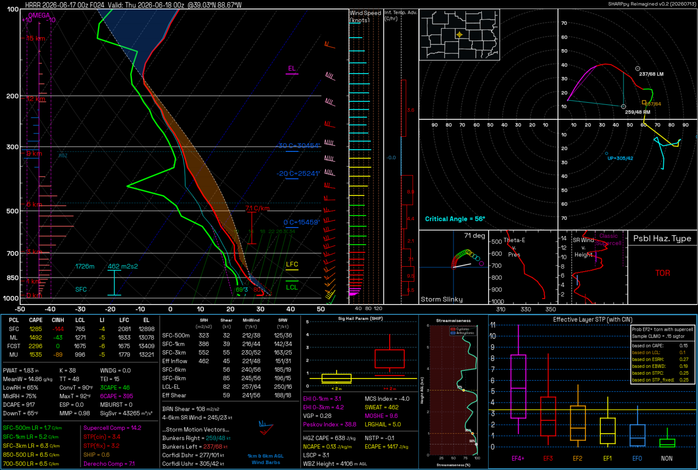

<div align="center">

# SHARPpy Reimagined

**Modern sounding analysis and SHARPpy-style rendering for Python 3.11+.**

[](https://github.com/ShianMike/SHARPpy-Reimagined/actions/workflows/tests.yml)


[](LICENSE)

</div>



SHARPpy Reimagined is a modernized, standalone fork of
[SHARPpy](https://github.com/sharppy/SHARPpy), focused on packageable Python
3.11+ workflows, Qt6/PySide6 rendering, and reproducible point-sounding tools.
It keeps the familiar SPC-style skew-T, hodograph, hazard, and derived-parameter
views while adding clean command-line entry points, bundled resources, and a
test-backed decoder/extractor layer.

## Highlights

- Headless PNG rendering for `.npz`, SPC tabular, BUFKIT, PECAN, and WRF-ARW
  text sounding inputs.
- Portable `.npz` point-sounding output from UWyo, ERA5, WRF-ARW, and bundled
  model examples.
- Qt6/PySide6 compatibility shims around the upstream SHARPpy widget stack.
- Offline UWyo station catalog plus package-relative bundled fonts.
- Property-based pytest coverage for decoders, derived parameters, hazards,
  renderer-facing widgets, and extraction paths.

## Quick Start

Requires Python 3.11 or newer.

```bash
python -m pip install -e ".[render]"
python -m pip install --no-deps "SHARPpy==1.4.0a5"

sharpmod-render examples/soundings/hrrr_point_36.68N_95.66W_f018.npz out.png
```

The upstream `SHARPpy==1.4.0a5` package is installed with `--no-deps` because
its published metadata pins an old NumPy version. SHARPpy Reimagined provides
the modern runtime dependencies separately.

## Command Line Tools

| Command | Purpose |
| --- | --- |
| `sharpmod-render` | Render a sounding file to a PNG |
| `uwyo-sounding` | List, search, and fetch University of Wyoming soundings |
| `era5-extract` | Extract an ERA5 point sounding to `.npz` |
| `wrf-extract` | Extract a WRF-ARW point sounding to `.npz` |

```bash
# Observed sounding: fetch Norman, OK at 00Z and render it
uwyo-sounding fetch 72357 "2024-05-20 00" --out oun.npz --render oun.png

# Reanalysis / model point soundings
era5-extract "2024-05-20 00:00" 35.18 -97.44 era5.npz --render
wrf-extract wrfout_d01_2024-05-20_00:00:00 35.18 -97.44 wrf.npz --render
```

## Install Extras

| Extra | Installs | Use it for |
| --- | --- | --- |
| `[render]` | SHARPpy runtime companions | PNG rendering |
| `[era5]` | Herbie, cfgrib, xarray | ERA5 point extraction |
| `[wrf]` | xarray, netCDF4 | WRF-ARW NetCDF extraction |
| `[dev]` | pytest, Hypothesis | Test and development work |

```bash
python -m pip install -e ".[dev,era5,wrf,render]"
python -m pip install --no-deps "SHARPpy==1.4.0a5"
pytest
```

For the full setup reference, see [`installation.txt`](installation.txt). For
usage recipes and Python API examples, see [`docs/USAGE.md`](docs/USAGE.md).

## Data Flow

```text
UWyo / ERA5 / WRF / HRRR
          |
          v
portable .npz point sounding
          |
          v
sharpmod-render
          |
          v
SPC-style skew-T + hodograph PNG
```

## Repository Map

```text
sharpmod/
  sharptab/     derived-parameter and meteorological calculations
  io/           decoders for SPC, BUFKIT, PECAN, WRF-ARW, .npz, and UWyo
  viz/          Qt6/PySide6 rendering widgets
  tools/        UWyo, ERA5, WRF, and render command-line tools
  resources/    bundled fonts and station catalog
  tests/        unit, smoke, and property-based tests

examples/
  example_sounding.png
  soundings/    bundled sample inputs

docs/
  USAGE.md      workflow guide and API examples
```

## Attribution

This project builds on the abandoned upstream
[SHARPpy](https://github.com/sharppy/SHARPpy) project. See [`LICENSE`](LICENSE)
for license terms and attribution.
