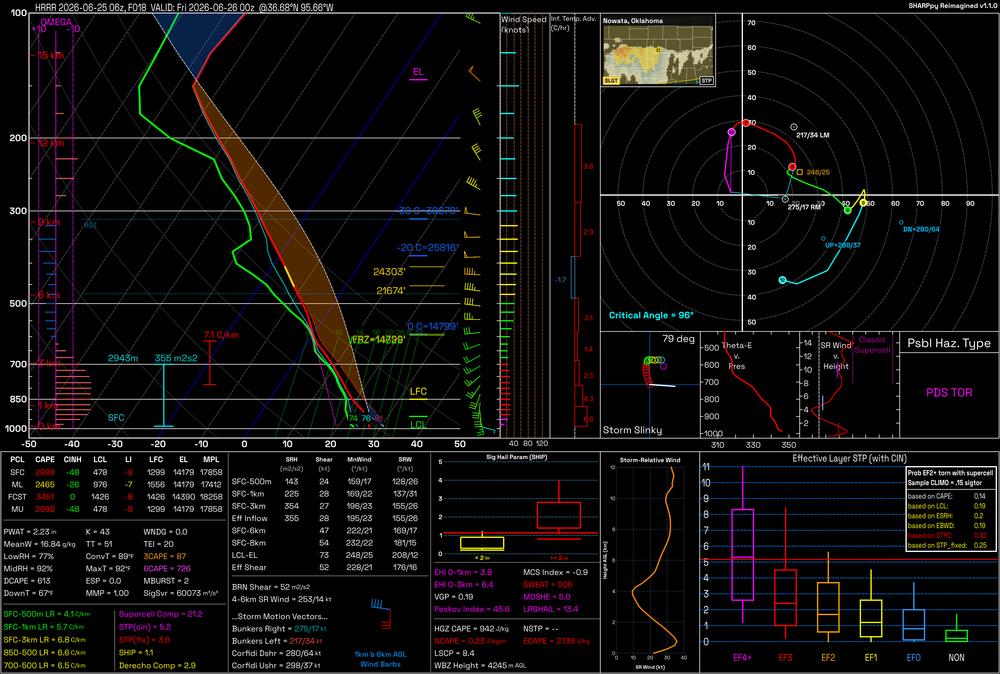
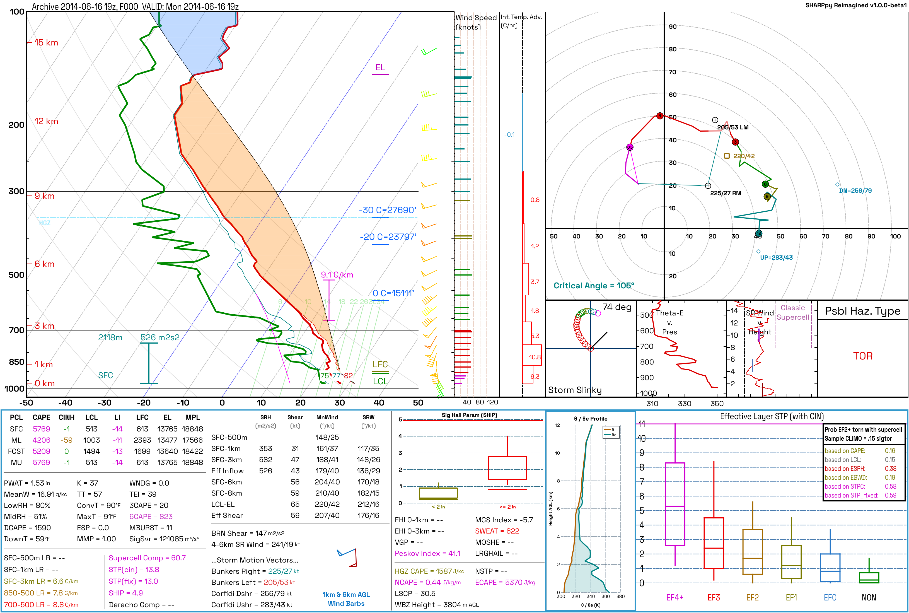
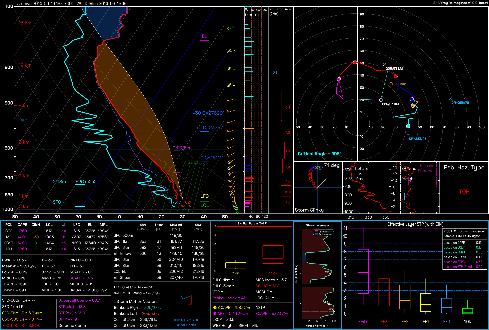

<div align="center">

# SHARPpy Reimagined

**Modern sounding analysis and SHARPpy-style rendering for Python 3.11–3.13**

[](https://github.com/ShianMike/SHARPpy-Reimagined/actions/workflows/tests.yml)


[](LICENSE)

</div>



<sub>HRRR forecast point 36.68N 95.66W, F018, in the default Standard (dark)
palette with the Storm-Relative Wind chart selected — rendered from
[`examples/soundings/hrrr_point_36.68N_95.66W_f018.npz`](examples/soundings/hrrr_point_36.68N_95.66W_f018.npz).</sub>

SHARPpy Reimagined is a modernized, standalone fork of
[SHARPpy](https://github.com/sharppy/SHARPpy), focused on packageable Python
3.11–3.13 workflows, Qt6/PySide6 rendering, and reproducible point-sounding
tools. It keeps the familiar SPC-style skew-T, hodograph, hazard, and
derived-parameter views while adding a redesigned desktop interface, clean
command-line entry points, bundled resources, and a test-backed
decoder/extractor layer.

<details>
<summary><b>Canvas palettes</b> — light and colorblind modes (OAX 2014-06-16 19Z observed sounding)</summary>

Both palettes below render the same *different* sounding — the bundled OAX
observed profile — so the palette change is visible independently of the data.
Switch with **File → Preferences** (Standard / Inverted / Protanopia); the
choice persists across launches and applies to every panel and inset.

**Inverted (light mode) — θ / θe Profile**



**Protanopia (colorblind mode) — Streamwiseness**



All three captures were regenerated from 1.0.0-beta1. Together they demonstrate
three choices in the right-clickable chart slot: Storm-Relative Wind in the
Standard example above, θ / θe Profile in Inverted, and Streamwiseness in
Protanopia.

</details>

---

## Contents

- [What's new in 1.0.0-beta1](#whats-new-in-100-beta1)
- [Highlights](#highlights)
- [Quick start](#quick-start)
- [Desktop GUI](#desktop-gui)
  - [Loading a sounding](#loading-a-sounding)
  - [Working with a sounding](#working-with-a-sounding)
  - [Themes and palettes](#themes-and-palettes)
  - [Analysis sessions](#analysis-sessions)
  - [Export](#export)
  - [Data management and persistence](#data-management-and-persistence)
- [Command line tools](#command-line-tools)
  - [Forecast-model extraction](#forecast-model-extraction-model-extract)
  - [Batch and multi-point extraction](#batch-and-multi-point-extraction)
  - [Configured models](#configured-models)
- [Backends and performance](#backends-and-performance)
- [Standalone executable (Windows)](#standalone-executable-windows)
- [Install extras and testing](#install-extras-and-testing)
- [Data flow](#data-flow)
- [Repository map](#repository-map)
- [Attribution](#attribution)

---

## What's new in 1.0.0-beta1

1.0.0-beta1 keeps the default scientific canvas from 0.9.0 while expanding the
data and controls around it:

- **Four charts in one slot.** Right-click the streamwiseness chart to switch
  among Streamwiseness, Storm-Relative Wind, θ / θe Profile, and Stepwise CIN &
  CAPE. The more expensive alternatives are computed only when opened and then
  cached.
- **RRFS-A on a project-owned NOMADS route.** The app pairs the published
  pressure-level and ground products directly, enabling five domains: CONUS,
  Alaska, Hawaii, Puerto Rico, and 13 km North America.
- **DWD ICON Global through Open-Meteo.** The new `icon` route provides global
  11 km point profiles without requiring a local GRIB runtime, using only the
  pressure levels and forecast hours the model actually publishes.
- **Live map overlays.** The Station Map and Forecast Model tabs can display a
  NOAA MRMS radar mosaic and a time-aware SPC convective outlook, including
  categorical risk and tornado, wind, and hail probabilities. Both remain off
  until requested.
- **A consistent picker control rail.** Shared layout and control patterns align
  the source panels, and the compact forecast rail now fits a maximized window
  without putting point and fetch controls below the fold.

The full list is in [`CHANGELOG.md`](CHANGELOG.md).

---

## Highlights

- Headless PNG rendering for `.npz`, SPC tabular, BUFKIT, PECAN, and WRF-ARW
  text sounding inputs.
- Portable `.npz` point-sounding output from UWyo, the independent IEM RAOB
  archive, ERA5, WRF-ARW, Herbie-backed forecast models, RRFS-A over NOAA
  NOMADS, ECCC GeoMet, and Open-Meteo.
- Resumable multi-point/multi-hour jobs with one download per shared model hour,
  bounded concurrency, atomic outputs, and a checksummed versioned manifest.
- A redesigned Qt6/PySide6 desktop application over the upstream SHARPpy widget
  stack, with compatibility shims rather than forked widgets.
- A supported Rust-primary numerical and point-decoding backend, with an
  independently optimized Python fallback and byte-level equivalence coverage
  across the GRIB-decoding models. 19 public forecast products are configured;
  see [Configured models](#configured-models).
- A complete inverted/light sounding palette shared by the interactive GUI and
  headless renderer, including contrast-aware labels and derived displays.
- Offline UWyo station catalog plus package-relative bundled fonts.
- Property-based pytest coverage for decoders, derived parameters, hazards,
  renderer-facing widgets, and extraction paths.

---

## Quick start

Requires Python 3.11, 3.12, or 3.13.

```bash
python scripts/install_sharppy_compat.py

sharpmod-render examples/soundings/hrrr_point_36.68N_95.66W_f018.npz out.png
```

`sharpmod-render` writes a 2x HD PNG by default; add `--uhd` for the larger
2.8x export or `--lossless` for the original-size compact/lossless PNG.

The installer hash-verifies the official `SHARPpy==1.4.0a5` wheel, corrects
only its obsolete `numpy==1.15.*` requirement to this project's supported
range, records that provenance, installs the editable project plus render
stack, and requires `pip check` to pass. Use `--source-wheel PATH` for an
offline copy of the exact pinned upstream wheel.

For the full setup reference see [`installation.txt`](installation.txt); for
usage recipes and Python API examples see [`docs/USAGE.md`](docs/USAGE.md).

---

## Desktop GUI

```bash
sharpmod-gui          # or: python -m sharpmod.gui
```

On Windows, source-checkout GUI runs use Python 3.11–3.13. If this command is
invoked by Python 3.14 and the checkout has a `.venv` or `.gribenv`, the launcher
automatically hands the GUI to that compatible environment before Qt starts.
The packaged Windows release already bundles Python 3.11.

### Loading a sounding

The **Sounding Picker** opens with five sources:

- **Station Map** — a clickable map of every UWyo radiosonde station over a
  coastline basemap. Click a dot to select, double-click to open; scroll to
  zoom, drag to pan, and pick a region from the *Map area* menu. Observation
  times are selectable every three hours from 00Z through 21Z.
- **Station List** — the full catalogue with live id/name filtering and the
  same three-hourly UTC observation-time choices.
- **Forecast Model** — click a point or enter latitude/longitude, then choose a
  public model, UTC run, forecast hour, and optional ensemble member. The picker
  checks that inventory in the background. If publication is delayed, it offers
  the newest available earlier cycle without silently changing the selection;
  an uncertain check never disables manual Fetch. **Timeline…** queues a
  selected range of as many as 72 hours into one viewer with a slider, playback,
  step, and loop controls; completed hours remain available after cancellation
  or a missing hour.
- **Reanalysis (ERA5)** — choose any global point and hourly UTC analysis. The
  picker previews the snapped 0.25-degree grid point, validates the optional
  packages/CDS profile, caches completed point-hours, and keeps Qt responsive
  while the synchronous CDS request runs in a worker.
- **Open File** — a local `.npz`, SPC, BUFKIT, PECAN, or WRF-ARW text sounding
  (or just drag the file onto the window). Its **Raw WRF wrfout** workflow
  inspects a NetCDF domain/times in the background, validates a map point
  against the actual curvilinear grid perimeter, then extracts and opens it.

### Working with a sounding

Each sounding opens in the full interactive SPC window built on the upstream
SHARPpy widget stack, so everything in the
[SHARPpy GUI guide](https://sharppy.github.io/SHARPpy/interacting_gui.html)
still works.

**Editing and readouts**

- **Right-click the Skew-T** for the readout cursor, *Modify Surface*, parcel
  lifting, and reset.
- **Click + drag** temperature / dewpoint / wind points to edit the profile —
  every index recalculates live.
- **Double-click the lower-left inset** to swap lifted parcels.
- **Undo / Redo:** `Ctrl+Z` reverses profile, interpolation, and storm-motion
  edits; `Ctrl+Y` reapplies them. Each viewer retains the latest 50 edits.

**Hodograph**

Defaults to **Mean Wind** centering with a 20%-tighter viewport.
**Right-click** selects Mean Wind, Normal, or Storm Relative centering, and
**double-clicking** the RM/LM markers sets the storm motion. The active profile
has coloured dots with 0.5, 1, 3, 6, 9, and 12 inside them, and the locator
inset names the active sounding location/town in its title.

**Zoom and view**

| Gesture / key | Effect |
| --- | --- |
| **Scroll** over the Skew-T or hodograph | Zoom that panel alone; up magnifies, down returns. Each panel zooms independently. |
| **Ctrl+scroll** | Zoom the whole sounding, anchored on the pointer. |
| **Middle-button drag** | Pan, when the image is larger than the window. |
| `Ctrl+0` | Fit to window, and stay fitted as it resizes. |
| `Ctrl+1` | Actual size (100%) — the sharpest view, since the canvas is drawn at this size and any other scale is resampled. |
| `Ctrl++` / `Ctrl+-` | Step zoom. |
| Zoom slider | Continuous 20–400%. |
| `F11` / `Escape` | Enter / leave full screen. |
| `Ctrl+B` | Show or hide the sounding panel. |
| `F1` | The full in-app controls guide. |

Zooming a single panel stops at the normal view, so at the default, scrolling
that way does nothing — that is also the reset. There is no drag-to-pan inside a
magnified panel, because dragging edits the profile.

**Keys:** ← / → step in time, ↑ / ↓ change ensemble member, `Space` swaps focus,
`I` interpolates, `C` collects observed, `W` returns to the picker.

**Panels and reports**

- **Sounding panel** (`Ctrl+B`) lists every loaded sounding and marks the
  focused one, selects the ensemble member, and opens the source and quality
  report.
- **Data → Source & Quality Inspector…** shows the provider/source route,
  backend and decoder, cache status, level and missing-field counts, surface
  vorticity provenance, and non-mutating QC warnings for the focused profile.
- **File → Preferences** switches the colour palette (Standard / Inverted /
  Protanopia), units, and the parcel visualized by default when a Skew-T opens.

For what every displayed index means — its formula, the clamps applied in code,
its colour thresholds, and its literature reference — see the
[sounding parameter guide](sounding_parameter_guide.md).

### Themes and palettes

The **Inverted** palette is a complete light theme. Applying it updates the
Skew-T, hodograph, locator, storm slinky, inset products, IndexBoard, and
Streamwiseness panels in one live configuration change, and switches the
application chrome to `paper-light` at the same time. Theme-dependent text,
rules, legends, and semantic annotations are contrast-adjusted for a light
canvas while plotted scientific values, units, and established dark-theme
colours remain unchanged. Headless rendering uses the same selected palette.

### Analysis sessions

Use **File → Save Analysis Session…** (`Ctrl+Shift+E`) in a sounding window to
save every loaded sounding, the active profile, current profile/interpolation/
storm-motion edits, parcel selection, and viewer state. **Open Analysis
Session…** (`Ctrl+Shift+O`) is available from both the picker and sounding
window and restores the saved soundings together in one viewer.

Session files use the `.sharpmod-session` extension and a versioned, portable
JSON format; they do not execute code or embed source GRIB downloads. Forecast
download directories still follow the normal lifecycle and are deleted when
their original viewer closes.

### Export

The sounding window's **Export** menu saves the current view:

- **Export Image (HD PNG)** (`Ctrl+E`) — a 2x high-density image of the full
  window, including the mounted derived-parameter panels, with a sensible
  default filename (`STATION_YYYYMMDDHHZ_hd.png`) in your Desktop folder.
- **Export Image (UHD PNG)** — a larger 2.8x ultra-high-density image
  (`STATION_YYYYMMDDHHZ_uhd.png`).
- **Export Image (Lossless PNG)** — the original-size compact/lossless image
  for smaller files (`STATION_YYYYMMDDHHZ_lossless.png`).
- **Copy Image to Clipboard** (`Ctrl+Shift+C`) — the same current view, ready
  to paste into another app.
- **Export Text (SHARPpy)** — the focused profile as a text file that loads
  back into the app.

The upstream `File → Save Image` / `Save Text` actions remain available too.

External Windows automation can use
`pwsh -NoProfile -File scripts/copy-image-to-clipboard.ps1 IMAGE.png` instead
of embedding `DataObject`, `StringCollection`, and `System.Drawing.Image`
construction inside a quote-sensitive inline `pwsh -Command` string.

### Data management and persistence

**File → Downloaded Data Library…** browses, validates, reopens/re-extracts,
pins, deletes, or copies provenance for cached model data.
**Locations → Manage Saved Locations…** stores searchable named points, supports
versioned JSON import/export, and displays saved and recent points as map
markers. Only labels and coordinates are persisted.

GUI choices persist across launches, including temperature/wind/PWAT units,
palette, top/bottom readouts, default parcel, multi-sounding behavior, dismissed
tips, recent files, and last selections. On Windows they are stored in
`%APPDATA%\SHARPpy Reimagined\settings.ini`; set `SHARPMOD_SETTINGS_PATH` to
use a different INI file.

The ERA5 and raw-WRF source panels expose **Add to active sounding window**
directly. Leave it enabled, change the point or available time, and fetch again
to overlay several soundings; it stays synchronized with **File → Add New
Soundings to Active Window**.

<details>
<summary><b>Location naming and the locator inset</b></summary>

Forecast, ERA5, and raw-WRF points accept an optional **Location/town** label.
Named saved locations populate it directly. When it is blank, a bundled
52,818-entry U.S. Census place/town index resolves and persistently caches the
nearest title across the contiguous United States and D.C.; state polygons
prevent nearby Canadian, Mexican, Atlantic, and Gulf points from receiving a
U.S. name. The resulting name appears above the hodograph locator-map inset.

A rate-limited OpenStreetMap Nominatim request is only a fallback when the
bundled search has no result. Entering a label skips lookup entirely, and
`SHARPMOD_GEOCODER_URL=off` disables that fallback. Headless rendering resolves
generic labels such as `HRRR 41.53N 88.39W` through the same path. Names are
used only for the title; no town labels are drawn inside the locator map.

See the
[Nominatim usage policy](https://operations.osmfoundation.org/policies/nominatim/)
and [OpenStreetMap attribution](https://www.openstreetmap.org/copyright), plus
the [offline CONUS index notes](docs/CONUS_PLACE_INDEX.md). The locator's map
context comes from separately bundled, one-degree Census county-outline tiles;
it performs no live map request and loads only tiles around the sounding.

</details>

---

## Command line tools

| Command | Purpose |
| --- | --- |
| `sharpmod-render` | Render a sounding file to a PNG |
| `uwyo-sounding` | List, search, and fetch University of Wyoming soundings |
| `observed-sounding` | Fetch from UWyo with an explicit IEM RAOB fallback |
| `era5-extract` | Extract an ERA5 point sounding to `.npz` |
| `model-extract` | Fetch all pressure levels for a supported forecast-model point sounding |
| `model-batch-extract` | Run a resumable multi-point/multi-hour model job |
| `wrf-extract` | Extract a WRF-ARW point sounding to `.npz` |
| `sharpmod-rust-sync` | Check, rebuild when needed, and verify the local Rust backend |

```bash
# Observed sounding: try UWyo, then the independent IEM RAOB archive
observed-sounding fetch 72357 "2024-05-20 00" --out oun.npz --render oun.png

# Render the mixed-layer parcel on the Skew-T (MU is the default)
sharpmod-render oun.npz oun_ml.png --parcel ML

# Reanalysis / local WRF point soundings
era5-extract "2024-05-20 00:00" 35.18 -97.44 era5.npz --render
wrf-extract wrfout_d01_2024-05-20_00:00:00 35.18 -97.44 wrf.npz --render

# Canadian point sounding through ECCC GeoMet (no full-grid download)
model-extract gdps 45.50 -73.60 montreal.npz --run "2026-07-22 00" --fxx 6
```

`sharpmod-render --parcel` accepts `SFC`, `ML`, `FCST`, `MU`, `EFF`, and
`USER`. Parcel keys are case-insensitive.

`era5-extract` retrieves all 37 pressure levels plus a colocated surface record
from the official Copernicus Climate Data Store API. Create a free CDS account,
accept both the ERA5 pressure-level and single-level dataset licences, and copy
the credentials shown on the
[CDS API setup page](https://cds.climate.copernicus.eu/how-to-api) into
`$HOME/.cdsapirc` before the first request. Public forecast models continue to
use Herbie and do not require CDS credentials.

### Forecast-model extraction (`model-extract`)

Install the GRIB stack before fetching model data. Add the render stack and the
upstream SHARPpy runtime when `--render` is needed:

```bash
# Extraction only
python -m pip install -e ".[era5]"

# Extraction plus PNG rendering
python scripts/install_sharppy_compat.py --extras era5,render
```

Discover the installed CLI and check remote inventory before a large fetch:

```bash
model-extract --help
model-extract --list
model-extract gfs --probe --fxx 0

# Also download and open the pressure-level subset during the probe
model-extract gfs --probe --fxx 0 --open-subset

# Check recent completed cycles and fail until the verified ground contract
# is complete (useful for provider monitoring)
model-extract rrfs-a --probe --lookback-cycles 12 --require-surface-contract
```

Fetch a point sounding by model key, latitude, and longitude:

```bash
# Keep the portable .npz and its .json metadata sidecar
model-extract gfs 35.18 -97.44 gfs_oun.npz --fxx 0 --loc "Norman, OK"

# Select an exact UTC cycle and forecast hour
model-extract gfs 35.18 -97.44 gfs_oun_f006.npz --run "2026-07-14 00:00" --fxx 6

# Render to a named PNG; fetched GRIB/.npz/.json data is removed afterward
model-extract hrrr 35.18 -97.44 --fxx 0 --render hrrr_oun.png

# Omit the PNG name to use the generated point-sounding filename stem
model-extract hrrr 35.18 -97.44 --fxx 0 --render

# Select an ensemble member (GEFS defaults to c00)
model-extract gefs 35.18 -97.44 gefs_p01.npz --fxx 0 --member p01
```

If `--run` is omitted, the CLI chooses the most recent configured cycle at or
before the current UTC time; upstream publication can lag that cycle, so use
`--probe`, use `--lookback-cycles`, or pass an earlier `--run` when inventory is
not available. `--require-surface-contract` makes a probe fail until surface
pressure/height, 2 m thermodynamics, and both 10 m wind components are present,
and lists the missing components. Without `--render`, the `.npz` and `.json`
outputs remain. With `--render`, only the PNG remains. The GUI instead retains
fetched files until the sounding window closes.

**The verified surface contract.** Every forecast extraction requires true
surface pressure and terrain height, 2 m temperature/moisture, and 10 m wind.
Isobaric records whose pressure exceeds the selected point's surface pressure
are discarded, then the verified ground row is prepended. ERA5 retrieves the
matching single-level fields in a second colocated CDS request. A provider that
does not publish the complete surface contract fails explicitly instead of
emitting a pressure-only profile. The completed profile must also pass
monotonic-pressure/height, thermodynamic, and wind quality checks before it is
written.

### Batch and multi-point extraction

`model-batch-extract` accepts heterogeneous points and forecast hours. Requests
with the same model, UTC run, forecast hour, and member share one decoded
model-hour lease, while different hours run with a bounded 1–4 worker pool.
Single-point hours retain the normal point/subregion route and its GUI-compatible
spatial cache key; multi-point hours fetch one reusable field subset and decode
all local-GRIB points with vector element reads. Every `.npz` and `.json`
sidecar is atomic. The checksummed manifest is also atomic, so rerunning the
same command validates and skips completed outputs.

```json
{
  "version": 1,
  "requests": [
    {"id": "oun-f000", "model": "gfs", "lat": 35.18, "lon": -97.44,
     "run": "2026-07-14T00:00:00Z", "fxx": 0, "output": "oun/f000.npz"},
    {"id": "ict-f000", "model": "gfs", "lat": 37.65, "lon": -97.43,
     "run": "2026-07-14T00:00:00Z", "fxx": 0, "output": "ict/f000.npz"},
    {"id": "oun-f006", "model": "gfs", "lat": 35.18, "lon": -97.44,
     "run": "2026-07-14T00:00:00Z", "fxx": 6, "output": "oun/f006.npz"}
  ]
}
```

```bash
model-batch-extract job.json --output-dir batch-output --workers 2
```

The Python API is `sharpmod.batch_extract.run_batch(...)`; it accepts ordered
`BatchRequest` values and returns ordered per-request results plus completed
NPZ paths. Call `BatchExtractor.cancel()` for cooperative cancellation.
Pass an existing `ModelHourCache` as `model_hour_cache=` when a GUI or service
owns a longer-lived cache; the batch runner leases it but does not clear it.

### Configured models

These are the canonical keys accepted by this checkout. `model-extract --list`
is the runtime source of truth and also reports known models that are not
enabled. Remote run availability still depends on the upstream provider.

| Canonical key | Model / product | Coverage | Configured forecast hours | Aliases / notes |
| --- | --- | --- | --- | --- |
| `hrrr` | HRRR pressure levels | CONUS | 00/06/12/18Z: F000-F048 hourly; other cycles: F000-F018 hourly | — |
| `rap` | RAP 13 km AWIPS pressure levels | CONUS | F000-F051 hourly | — |
| `nam` | NAM 12 km pressure levels | CONUS | F000-F084 every 3 hours | — |
| `nam-3km-conus` | NAM 3 km CONUS nest | CONUS | F000-F060 hourly | `nam3`, `nam-3km` |
| `hrw-wrf-arw` | NOAA HiResW WRF-ARW 5 km | CONUS | F000-F048 hourly | 00/12Z only; `hiresw-arw`, `hrw-arw` |
| `hrw-fv3` | NOAA HiResW FV3 5 km | CONUS | F000-F048 hourly | 00/12Z only; `hiresw-fv3` |
| `rrfs-a` | RRFS-A 3 km pressure levels | CONUS | F000-F084 hourly | 00/06/12/18Z only; `rrfs`; no omega; ~340 MB per model hour |
| `rrfs-a-alaska` | RRFS-A 3 km Alaska nest | Alaska | F000-F084 hourly | 00/06/12/18Z only; `rrfs-ak`, `rrfs-alaska` |
| `rrfs-a-hawaii` | RRFS-A 2.5 km Hawaii nest | Hawaii | F000-F084 hourly | 00/06/12/18Z only; `rrfs-hi`, `rrfs-hawaii` |
| `rrfs-a-puerto-rico` | RRFS-A 2.5 km Puerto Rico nest | Puerto Rico | F000-F084 hourly | 00/06/12/18Z only; `rrfs-pr`, `rrfs-puerto-rico` |
| `rrfs-a-north-america` | RRFS-A 13 km North America | North America | F000-F084 hourly | 00/06/12/18Z only; `rrfs-na`; cheapest RRFS domain covering CONUS |
| `gfs` | GFS 0.25-degree pressure levels | Global | F000-F120 hourly, then every 3 hours to F384 | — |
| `cfs` | CFS 6-hourly pressure levels | Global | F000-F384 every 6 hours | Member 1 by default |
| `ecmwf-ifs` | ECMWF IFS Open Data | Global | 00/12Z: F000-F144 every 3 hours, then every 6 hours to F360; 06/18Z short cut-off stops at F144 | `ecmwf`, `ifs` |
| `ecmwf-aifs` | ECMWF-AIFS Open Data | Global | F000-F360 every 6 hours | `aifs` |
| `openmeteo-icon-global` | DWD ICON Global 11 km point profile | Global | F000-F078 hourly, then every 3 hours to F180; 06/18Z stops at F120 | `icon`, `icon-global`, `om-icon`; 12 measured pressure levels |
| `gefs` | GEFS 0.5-degree pressure levels | Global | F000-F384 every 3 hours | Control member `c00` by default |
| `gdps` | Canadian GDPS 15 km point profile | Global | F000-F240 every 3 hours | 00/12Z; `gem-global`, `cmc-global` |
| `rdps` | Canadian RDPS 10 km point profile | North America / Arctic | F000-F084 hourly | 00/06/12/18Z; `gem-regional`, `cmc-regional` |

Every product in that table was confirmed against live data to return a
sounding with a merged verified surface row. Products that cannot are withheld
from the picker and the CLI rather than offered and then refused; `model-extract
--list` prints them with the measured reason. One is currently withheld:

| Canonical key | Why it cannot produce a sounding |
| --- | --- |
| `aigfs` | AIGFS splits pressure and surface products, and its `sfc` product publishes only 2-m temperature, 10-m winds, and mean-sea-level pressure. Surface pressure, terrain height, and 2-m moisture are absent from every AIGFS product. |

---

## Backends and performance

### Rust-primary backend

Official Windows executables bundle the supported `sharpmod_rs` extension,
and the default `auto` mode uses Rust after validating its package version,
backend API, and required operations. The independently optimized Python
implementation remains a fully functional portable fallback, so source and
Python-only installations do not require Rust, Cargo, maturin, or a native
extension to run.

The native API accelerates standard kinematics, SB/MU/ML parcel summaries,
traced surface/forecast/MU/ML/effective and user parcel ascents, DCAPE, and
direct pressure-level GRIB point decoding. The GUI continues to expose
SHARPpy-compatible profile and parcel objects, with automatic Python-oracle
fallback if a native operation is unavailable.

To add the Rust backend to a source installation, first install a stable Rust
toolchain (Rust 1.88 or newer), then run these commands in the same Python
environment as `sharpmod`:

```bash
python -m pip install -e ".[rust-build]"
sharpmod-rust-sync
sharpmod-rust-sync --check
```

`sharpmod-rust-sync` rebuilds only when `sharpmod_rs` is missing or its version
does not match this checkout, then verifies forced-Rust selection in a fresh
Python process. `--check` is non-mutating; use `--force` after editing native
source. Extension developers can still run `maturin develop --release --locked`
directly from `rust/sharpmod-rs`.

Select the backend with `SHARPMOD_BACKEND` before starting the application:

| Value | Behavior |
| --- | --- |
| `auto` | Default. Use Rust when it loads; otherwise use Python and record the fallback reason. |
| `python` | Require the optimized Python implementation. |
| `rust` | Require the Rust extension; report an error if it is unavailable or cannot load. |

Check the resolved backend without running a sounding workflow:

```bash
python -c "from sharpmod.backends import backend_info; print(backend_info())"
```

Rust is the supported primary backend when a compatible extension is present;
official Windows binaries include it. Standalone native wheels are still
CI/build artifacts rather than a separately published Python package. See the
[Rust backend guide](docs/RUST_BACKEND.md) for source-build instructions,
fallback behavior, platform status, limitations, tests, and benchmarks.

<details>
<summary><b>Forecast-decoder performance and validation</b></summary>

Version 0.8.0 includes the two independently optimized GRIB implementations
introduced in v0.4.0. The Python backend reuses a file inventory and
nearest-point selection, reads only the required scalar fields, and keeps
bounded inventory, point-selection, and decoded-sounding caches. The Rust
backend memory-maps each local subset, iterates ecCodes messages without
copying the GRIB payload, and returns one NumPy-compatible matrix through a
single Python call. Neither implementation requires speculative parallel
decoding.

Both decoders understand GRIB multi-field messages in which one physical
message contains separate U- and V-wind fields. Their equivalence preflight
checks selected grid coordinates, pressure ordering, missing masks, and values
within field-appropriate floating-point tolerances. The matrix covers HRRR,
RAP, NAM, NAM 3 km, HRW WRF-ARW, HRW FV3, RRFS-A, GFS, AIGFS, CFS, ECMWF IFS,
ECMWF-AIFS, and GEFS.

Products without a published relative- or absolute-vorticity field can retain
the full xarray compatibility path in the production extractor so the
neighbor-wind vorticity estimate is preserved; their direct point decoder is
still measured separately and is not an end-to-end timing of that production
route. Optional fields published at a single pressure, such as GEFS omega, are
aligned only to that pressure and remain missing at other levels instead of
being broadcast through the sounding. Optimized Python and Rust return matching
pressure-aligned omega values and missing masks. The old/new GEFS benchmark
difference records the correction of the frozen legacy xarray full-column
broadcast; it is not a Rust availability gap.

See the [all-model benchmark table](benchmarks/results/2026-07-16-all-model-decoding-windows-amd64.md),
its [raw JSON record](benchmarks/results/2026-07-16-all-model-decoding-windows-amd64.json),
and the [benchmark methodology](benchmarks/README.md). Network transfer is
excluded from decoder timings, and the JSON retains fixture hashes, raw
samples, selected coordinates, build fingerprints, and equivalence results.

</details>

<details>
<summary><b>Download acceleration and cache</b></summary>

The extractor keeps every pressure level published by the selected model while
avoiding fields that are duplicates for sounding construction. It tries the
smallest compatible route first:

1. HRRR F000 analyses use direct point reads from the public HRRR Zarr archive
   and normalize those columns straight into the compact decoder contract;
   Canadian GDPS/RDPS query their six surface layers first, then request only
   pressure layers above that ground pressure with bounded GeoMet fan-out.
2. Indexed subsets at or below 32 MiB use validated, coalesced HTTP byte ranges
   after selecting a healthy equivalent provider. Every indexed model uses up
   to four bounded range workers by default. Large coalesced spans are split
   into balanced fragments, with one session per worker, pinned object
   identity, ordered atomic assembly, resumable fragments, and an automatic
   sequential-range fallback. Live
   [RRFS](benchmarks/results/2026-07-22-rrfs-range-workers.md) and
   [all-model transport/decode](benchmarks/results/2026-07-22-all-model-fetch-decode-optimization.md)
   records retain timing and byte-equivalence evidence for that default.
3. Larger HRRR, RAP, NAM, NAM 3 km, HRW WRF-ARW/FV3, GFS, CFS, and GEFS
   transfers use a small NOAA NOMADS geographic subset; other indexed products
   retain the range route.
4. RRFS bypasses Herbie entirely and reads the published NOMADS `.idx`
   inventory itself, pulling both the `prslev` and `2dfld` products over byte
   ranges with eight workers by default. NOMADS offers RRFS no geographic
   subset, so a field plan costs its full domain footprint; the combined
   payload is cached per model hour and a provenance sidecar lets a repeat
   request skip the network. See [USAGE](docs/USAGE.md) for the per-domain cost.
5. Any unavailable or incompatible optimization falls back automatically to
   the standard Herbie download path.

Local GRIB files decode directly into compact NumPy columns. Products without
a pressure-level vorticity field use a four-neighbor U/V stencil read directly
from two GRIB messages instead of opening xarray wind cubes. Multi-point batch
jobs vectorize both the sounding columns and those stencils, so each selected
message is unpacked once for all requested points; this is vectorized I/O, not
unsafe decoder threading.

The GUI keeps downloaded model hours under
`%LOCALAPPDATA%\sharpmod\model-cache` on Windows (or the platform cache folder),
up to 3 GB and 48 hours by default. In the File menu, **Prefetch Next Forecast
Hour** optionally warms the next valid hour, **Clear Downloaded Model Cache**
removes retained entries, and the model tab's **Cancel** button stops the active
request. Verified partial files from compatible range downloads are retained so
the same request can resume. Cache paths and metadata carry a contract version;
payloads produced by an older extraction contract remain visible in the data
library but are never reopened as current soundings.

Advanced overrides are available for testing or constrained environments:

| Environment variable | Default | Effect |
| --- | --- | --- |
| `SHARPMOD_HRRR_BACKEND` | `auto` | `auto`, `zarr`, or `grib` for HRRR F000 |
| `SHARPMOD_POINT_BACKENDS` | `auto` | Set to `grib` to bypass point/subregion routes |
| `SHARPMOD_GRIB_DECODER` | `auto` | `auto` uses direct point decoding with xarray fallback; `direct` requires it; `xarray` forces the compatibility path |
| `SHARPMOD_PROVIDER_RACING` | `1` | Set to `0` to disable equivalent-provider probes |
| `SHARPMOD_RANGE_WORKERS` | `4` | HTTP range-request workers for indexed models, clamped to 1-8; decoder execution remains serial |
| `SHARPMOD_GEOMET_WORKERS` | `4` | Concurrent ECCC GeoMet layer-point requests, clamped to 1-8 |
| `SHARPMOD_MODEL_CACHE` | platform cache | Override the GUI model-cache directory |
| `SHARPMOD_MODEL_CACHE_GB` | `3` | Maximum retained cache size in GiB |
| `SHARPMOD_MODEL_CACHE_HOURS` | `48` | Maximum retained entry age |

</details>

---

## Standalone executable (Windows)

A one-folder, no-Python-required build is produced with PyInstaller. Install
the checkout itself first so the freezer can validate and bundle matching
package metadata:

```bash
python -m pip install ".[render,era5,wrf]"
python scripts/install_sharppy_compat.py --sharppy-only
python -m pip install pyinstaller
pyinstaller packaging/sharpmod_gui.spec --noconfirm
```

The result is `dist/SHARPpy-Reimagined/SHARPpy-Reimagined.exe`. Set
`SHARPMOD_ONEFILE=1` in the build environment for a single self-extracting
`dist/SHARPpy-Reimagined.exe` instead. The one-folder ZIP is the recommended
Windows download because it starts substantially faster; the release page
labels the one-file build `portable` and explains the startup tradeoff in prose.

The official release workflow builds and installs `sharpmod_rs` before
PyInstaller packages the executable, making Rust the `auto` backend in the
published application. For custom local builds, the spec collects a compatible
installed extension when present; otherwise it logs a warning and produces a
fully functional Python-fallback bundle.

Official releases first run the reusable test workflow against the exact source
commit, build with the direct dependency versions in
`constraints/release.txt`, and publish from a separate artifact-only job. Only
that final job receives GitHub `contents: write` permission. The build rejects
stale or in-tree release metadata, embeds `FileVersion` and `ProductVersion`
from `sharpmod/_version.py`, and verifies the source, Python metadata, Rust
module/metadata, frozen runtime, and PE fields all agree.

### Verifying a download

The Windows executables are **not code-signed**, so Windows SmartScreen may warn
the first time you run one. Choosing *More info → Run anyway* is expected.

Two things are published alongside every release so a download can still be
checked:

- `SHARPpy-Reimagined-<tag>-SHA256SUMS.txt` — compare with
  `Get-FileHash <file> -Algorithm SHA256`.
- GitHub build provenance — verify with
  `gh attestation verify <file> --repo ShianMike/SHARPpy-Reimagined`, which ties
  the artifact to the workflow run and commit that produced it.

---

## Install extras and testing

| Extra | Installs | Use it for |
| --- | --- | --- |
| `[render]` | SHARPpy runtime companions | PNG rendering |
| `[era5]` | CDS API, Herbie, cfgrib, ecCodes, xarray, numcodecs, pyproj | ERA5 and public forecast-model point extraction |
| `[wrf]` | xarray, netCDF4 | WRF-ARW NetCDF extraction |
| `[dev]` | pytest, Hypothesis, pytest-xdist, pytest-timeout, PyYAML | Test and workflow-validation work |
| `[quality]` | Ruff, pip-audit, pytest-cov | Static checks, dependency audit, and coverage |
| `[rust-build]` | maturin | Build the supported Rust backend locally (Rust toolchain installed separately) |

```bash
python scripts/install_sharppy_compat.py --extras dev,quality,era5,wrf,render

# Fast deterministic feedback with bounded, Qt-safe worker grouping.
python scripts/run_test_lane.py fast --workers 4

# Full 100-200-example scientific properties.
python scripts/run_test_lane.py property --workers 4

# Exact non-parallel release gate.
python scripts/run_test_lane.py serial-release

# Optional source-checkout Rust backend
python -m pip install -e ".[rust-build]"
sharpmod-rust-sync
```

Each lane checks its wall time against the versioned budget in
`constraints/test-performance-baseline.json`, which carries separate
`github-actions` limits because hosted runners are slower than the reference
machine. Hypothesis keeps an example database under `.hypothesis/`; a large
local cache inflates property-test timings on repeat runs.

---

## Data flow

```text
UWyo / ERA5 / WRF / public forecast models
                     |
                     v
          portable .npz point sounding
                     |
                     v
              sharpmod-render
                     |
                     v
       SPC-style skew-T + hodograph PNG
```

---

## Repository map

```text
sharpmod/
  gui.py        interactive desktop app entry point
  gui_picker.py sounding picker shell and source panels
  gui_viewer.py sounding window: zoom, view controls, sidebar, help
  theme.py      Qt-free design tokens and chrome style-sheet generator
  gui_theme.py  applies the chrome theme to a QApplication
  render.py     headless PNG render entry point
  backends/     optimized Python/Rust kernels and direct GRIB point decoders
  sharptab/     derived-parameter and meteorological calculations
  io/           decoders for SPC, BUFKIT, PECAN, WRF-ARW, .npz, and UWyo
  viz/          Qt6/PySide6 rendering widgets
  tools/        UWyo, ERA5, forecast-model, WRF, basemap, and render CLI tools
  resources/    bundled fonts, station catalog, and GUI basemap/icons
  tests/        unit, smoke, and property-based tests

packaging/
  sharpmod_gui.spec   PyInstaller spec for the standalone GUI build

rust/sharpmod-rs/     supported PyO3/maturin backend extension crate
benchmarks/           Python-versus-Rust equivalence-first timing harness

examples/
  example_sounding.png
  soundings/    bundled sample inputs

docs/
  USAGE.md         workflow guide and API examples
  RUST_BACKEND.md  Rust-primary setup, fallback behavior, and limitations
```

Reference documents:

- [`CHANGELOG.md`](CHANGELOG.md) — release history
- [`sounding_parameter_guide.md`](sounding_parameter_guide.md) — every displayed
  index: formula, clamps, colour thresholds, and literature reference
- [`installation.txt`](installation.txt) — full setup reference
- [`docs/USAGE.md`](docs/USAGE.md) — workflow guide and Python API examples

---

## Attribution

This project builds on the abandoned upstream
[SHARPpy](https://github.com/sharppy/SHARPpy) project. See [`LICENSE`](LICENSE)
for the BSD 3-Clause terms and [`NOTICE`](NOTICE) for upstream attribution.
