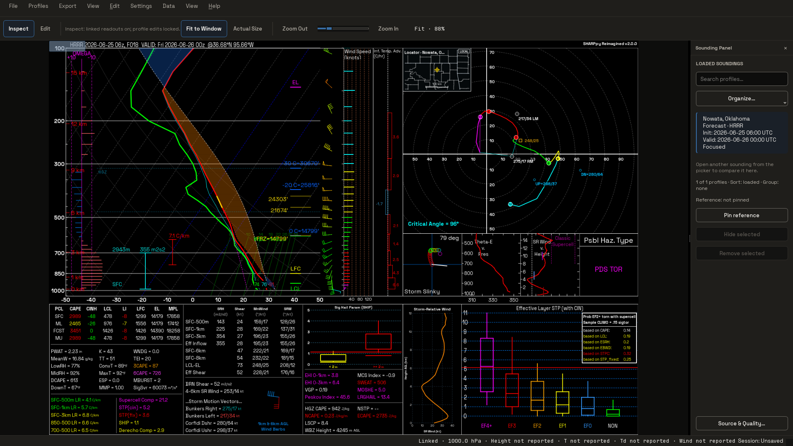
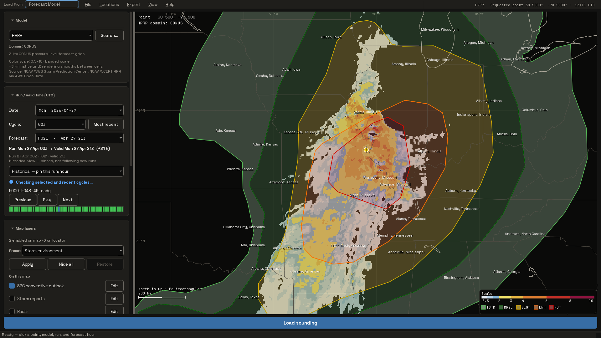
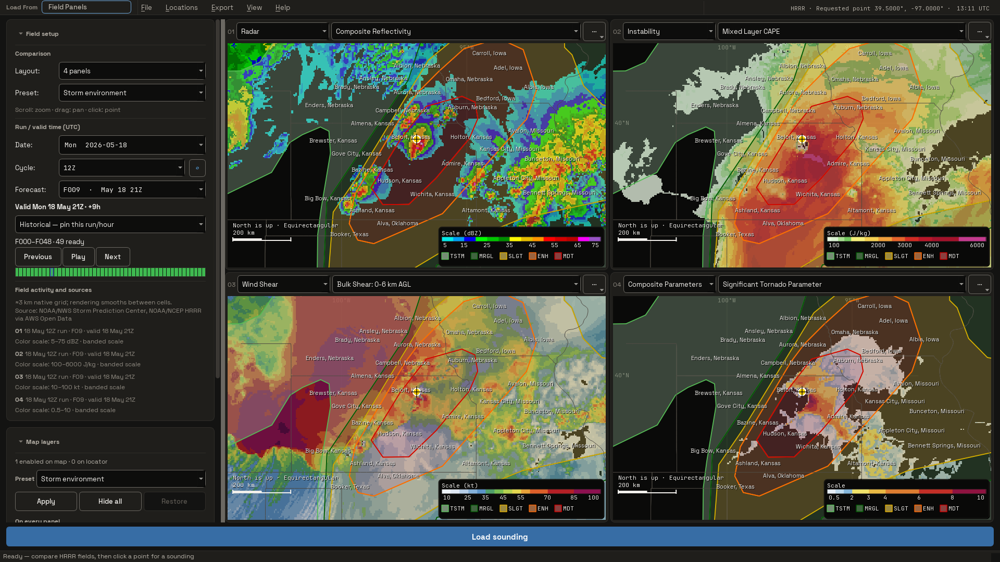
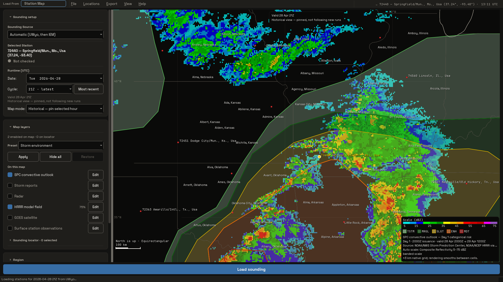

# SHARPpy Reimagined

**Severe-weather soundings, forecast fields, and maps in one desktop workspace.**

[Explore the app](#explore-the-app) · [Get started](#get-started) · [Guides](#guides) · [Downloads](https://github.com/ShianMike/SHARPpy-Reimagined/releases)

SHARPpy Reimagined brings [SHARPpy](https://github.com/sharppy/SHARPpy) sounding analysis into a modern Qt desktop app. Pick a station or forecast point, inspect severe-weather fields and outlooks, then open the Skew-T, hodograph, and analysis workspace. Published Windows builds are on the [Releases page](https://github.com/ShianMike/SHARPpy-Reimagined/releases).

## What's new in 2.0.0

Safer profile editing, a four-tab analysis workspace, synchronized field panels, and clearer map and export controls. See the [changelog](CHANGELOG.md) for the full list.

## Explore the app

Open a case to see the real app. Each image is a **1920 × 1080** window capture; click an image to open its original pixels. The four screens use **different archived severe-weather days**. Model fields are HRRR guidance, while the risk outlines are the SPC outlook valid at the displayed time.

<strong>June 25–26 · Nowata, Oklahoma · Sounding and hodograph</strong>

HRRR run **June 25, 06Z**, forecast **F018**, valid **June 26, 00Z**. The bundled [Nowata point sounding](examples/soundings/hrrr_point_36.68N_95.66W_f018.npz) drives the sounding; the locator uses the matching HRRR field and archived SPC outlook. [Open full-size PNG](docs/images/v2.0.0/sounding.png).

<strong>April 27 · Missouri and Illinois · Forecast Model</strong>

HRRR **00Z F021**, valid **21Z**: significant tornado parameter and the SPC categorical outlook around the Missouri–Illinois risk area. [NWS event background](https://www.weather.gov/ilx/swop-042726) · [Open full-size PNG](docs/images/v2.0.0/forecast-model.png).

<strong>May 18 · Kansas · Four Field Panels</strong>

HRRR **12Z F009**, valid **21Z**: compare reflectivity, mixed-layer CAPE, 0–6 km shear, and significant tornado parameter at the same point and time. [NWS event background](https://www.weather.gov/top/May182026Tornadoes) · [Open full-size PNG](docs/images/v2.0.0/field-panels.png).

<strong>April 28 · Southwest Missouri · Map overlays</strong>

HRRR **21Z F000**, valid **21Z**: Springfield station map with model reflectivity and SPC categorical risk layers. [NWS event background](https://www.weather.gov/sgf/Hailstorm_April_28_2026) · [Open full-size PNG](docs/images/v2.0.0/map-overlays.png).

### What can I do here?

| In the app | Try |
| --- | --- |
| **Pick a sounding** | Search stations, choose a forecast point, or open a local sounding. |
| **Explore a map** | Select a point, inspect values, pan or zoom, and toggle independent layers. |
| **Compare fields** | Put two or four synchronized HRRR products beside the outlook. |
| **Work with soundings** | Inspect or edit a profile; use **Trends**, **Compare**, **Ensemble**, and **Animation** in the analysis workspace. |
| **Share results** | Export sounding images, comparison charts, maps, data, and animations. |

## Get started

For the source checkout, use **Python 3.11–3.13**. On Windows PowerShell:

~~~powershell
py -3.11 -m venv .venv
.\.venv\Scripts\Activate.ps1
python scripts/install_sharppy_compat.py --extras era5
sharpmod-gui
~~~

The installer sets up the project and the verified upstream SHARPpy render wheel; the `era5` extra enables public forecast-model and ERA5 extraction. For other platforms, offline installation, and dependency details, see [installation.txt](installation.txt). Published Windows builds are available from [Releases](https://github.com/ShianMike/SHARPpy-Reimagined/releases).

Want a PNG from a saved sounding? Run `sharpmod-render INPUT.npz OUTPUT.png`. The [usage guide](docs/USAGE.md) has complete GUI and command-line examples.

## Guides

- [Using the desktop app and CLI](docs/USAGE.md)
- [Maps, comparisons, ensembles, and exports](docs/ADVANCED_ANALYSIS.md)
- [Installation and optional dependencies](installation.txt)
- [Rust backend and Python fallback](docs/RUST_BACKEND.md)
- [Changes in 2.0.0](CHANGELOG.md)
- [Contributing and test lanes](CONTRIBUTING.md)

The screenshots can be reproduced with `python scripts/capture_readme_cases.py`; it fetches the archived SPC outlooks and HRRR fields for the four exact UTC cases, then checks every saved PNG is 1920 × 1080.

SHARPpy Reimagined is a fork of [SHARPpy](https://github.com/sharppy/SHARPpy) and is distributed under the [BSD 3-Clause License](LICENSE). NOAA/NWS [HRRR](https://www.nco.ncep.noaa.gov/pmb/products/hrrr/) and [SPC outlook](https://www.spc.noaa.gov/products/outlook/) data appear in the case captures.
